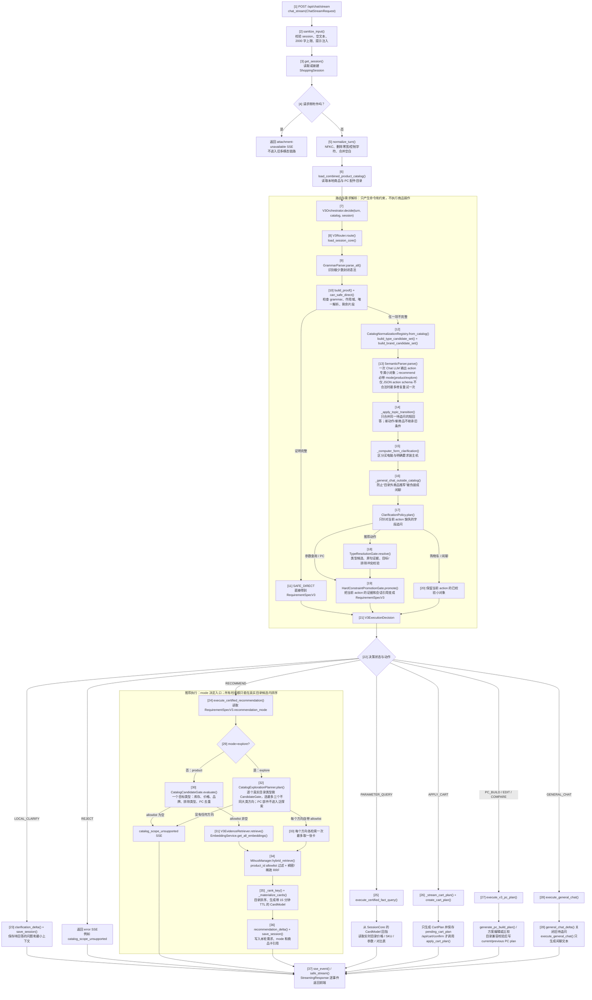

# MallMind V3

MallMind 是一个以**本地商品目录为唯一事实来源**的电商导购服务。它的目标不是让大模型直接“推荐一个商品”，而是把大模型限制在理解自然语言这一件事上；商品、SKU、价格、库存、商品卡和购物车结果都必须由本地目录或会话中的有效引用产生。

当前生产聊天入口只有 V3：旧的 `fast/balanced/full` 运行模式、8 工具 Router、旧 `/api/chat` 与 `/api/recommend` 兼容链路均不在生产请求路径中。

## 1. 当前项目能做什么

| 用户要做的事 | V3 动作 | 实际执行入口 | 系统如何保证不乱答 |
| --- | --- | --- | --- |
| 推荐明确品类 | `recommend_shopping_products`，`mode=product` | `execute_certified_recommendation()` | 要先确定一个真实目录类型；再按类型、库存、预算、品牌和排除条件筛选商品，最后才检索和出卡。 |
| “随便看看/不知道买什么/送礼不知道买什么”等开放式购物 | `recommend_shopping_products`，`mode=explore` | `CatalogExplorationPlanner.plan()` | 不假装知道用户偏好；从真实目录中选最多三个不同大类方向，每个方向最多出一张真实、有货、未被排除的卡。 |
| 问“第一个多少钱”“第二个有哪些 SKU”“比较前两个” | `parameter_query` | `execute_certified_fact_query()` | 只能使用未过期 `CardModel` 找回真实商品，再读取当前目录。 |
| 加入、删除、改数量、查看、清空购物车 | `apply_cart_instruction` | `create_cart_plan()` / `apply_cart_plan()` | 先创建 60 秒有效的计划，只有 `/api/cart/confirm` 确认后才写购物车。 |
| 按预算配一台主机，或改显卡、改预算、比较两套方案 | `generate_pc_build_plan` / `edit_pc_build_plan` / `compare_pc_build_plans` | `execute_v3_pc_plan()` | 只把预算、用途、替换意图交给本地求解器；模型不能指定配件 ID。 |
| 非购物闲聊 | `general_chat` | `execute_general_chat()` | 可调用文本模型；HTTP 层只会关闭过期的待追问，不会让闲聊函数改目录、购物车或推荐结果。 |

图片附件当前**明确拒绝**：`chat_stream()` 检测到附件后返回 SSE 错误，不会偷偷回退到旧的多模态链路。商品图片仍作为前端静态资源保留，但不参与当前 V3 聊天语义解析。

## 2. 用户发出一句话后，完整链路是什么

下面是当前代码真实执行的主链路。方框中的编号与下一节的函数索引一一对应；没有把“未来可能需要的模块”画成已经存在的能力。



### 用最直白的话解释这张图

1. **先防错，再理解。** `sanitize_input()` 不会“猜”用户的意思；它只拦空请求、超长文本和明显提示注入。`normalize_turn()` 只统一字符和空白，保留原话作为后续证据来源。
2. **本地规则只处理它能证明的极少数句子。** 例如规则不仅要看见“推荐、手机、5000 元以内、不要小米”，还要证明这些词的作用范围、解析结果和业务字段都是唯一的。任何一点不确定，就不走本地直通。
3. **复杂中文通常只调用一次语义模型，而且只返回一个和动作匹配的小对象。** 推荐对象必须有 `mode`：`product` 表示“给我推荐手机/平板”等已经指明类型的请求，`explore` 表示“随便看看/不知道买什么”等主动不限定类型的请求。模型若已经返回 JSON、但多写了字段或枚举不合法，系统会原样保留第一次失败记录，再要求它修复一次；超时、网络错误、目录错误和第二次仍不合法都不重试，更不会有第三次。问价格、购物车、PC 也各有自己的小对象。模型不能输出商品 ID、SKU、价格、库存或购物车结果。
4. **模型说的每个关键条件都要经过本地边界。** 类型 ID 必须来自本轮目录候选菜单；`product` 模式没有目标类型不能执行，`explore` 模式反而不允许携带目标类型。模型没选 ID、只报原词时，`TypeResolutionGate` 才要求原句片段核验。`HardConstraintPromotionGate` 继续核验价格、品牌和卡片引用；未通过就追问或拒绝，不拿模型猜测去检索。
5. **推荐一定是“先过滤、后检索”。** `product` 模式只对一个已确认类型形成 allowlist；`explore` 模式在每个真实目录类型内先运行 CandidateGate，再从最多三个不同大类方向各保留一个 allowlist。Milvus 只能在这些允许商品 ID 集合中排序，不能把被排除商品找回来，也不能把目录外商品造出来。
6. **问价格、SKU、参数和比较不走 RAG 推荐。** 系统先检查用户是否在引用未过期商品卡，再读当前目录。因此模型记忆不会被当成商品事实。
7. **会话只存下一轮真正需要的短期信息，也会明确处理换话题。** 它不塞完整聊天记录，而是存当前需求（含 `recommendation_mode`）、商品卡引用、待澄清问题、购物车待确认计划和两版 PC 方案。只有“对上轮追问的短回答”或“不重新点名品类的同一推荐补充条件”才会合并；用户点名新商品、切到价格/SKU/购物车/PC，或插入泛聊时，旧待追问不会偷偷带入新工具。
8. **当前没有独立的 `TraceStore`。** 推荐结果会在 SSE `result.trace` 中带回候选范围和检索信息，异常写服务端日志；这不是可长期查询的独立追踪库，不能把它误认为已经实现。

## 3. 图中节点与代码索引

| 图中编号 | 文件与函数 | 它具体做什么 |
| --- | --- | --- |
| 1 | `rag/api/routes/chat.py::chat_stream` | V3 SSE 聊天 HTTP 入口；组装生成器并选择后续执行器。 |
| 2 | `rag/api/routes/chat.py::sanitize_input`、`rag/security/prompt_guard.py::detect_injection` | 校验 `session_id`、空文本、长度和提示注入；失败直接返回 HTTP 错误。 |
| 3 | `rag/recommendation/session_state.py::get_session` | 从内存或 Redis 读取 `ShoppingSession`；这里不解释业务字段。 |
| 4 | `chat_stream` 内附件分支 | 当前 V3 明确拒绝附件，防止落回已废弃链路。 |
| 5 | `rag/recommendation/v3/normalization.py::normalize_turn` | 产生不可变 `NormalizedTurn`；只做 NFKC、零宽字符、控制字符和空白处理。 |
| 6 | `rag/recommendation/product_loader.py::load_combined_product_catalog` | 加载合并后的商品和 PC 配件目录，是商品事实源。 |
| 7 | `rag/recommendation/v3/orchestrator.py::V3Orchestrator.decide` | 唯一的“路由 + 需求编排”入口；自己不检索、不改购物车、不生成回答。 |
| 8--11 | `router.py::V3Router.route`、`grammar.py::GrammarParser.parse_all`、`proof.py::build_proof` / `can_safe_direct` | 受限 grammar 产生解析树和 `SafetyProof`；只有证明完整才给出本地 `RequirementSpecV3`。 |
| 12 | `registry.py::CatalogNormalizationRegistry.from_catalog`、`type_candidates.py::build_type_candidate_set`、`semantic_contracts.py::build_brand_candidate_set` | 使用目录统一品牌/类型词表；类型生成 A（原句精确命中）+ B（整句字符 n-gram）+ C（动作词附近片段）候选，品牌只保留本轮原句中确实出现的目录别名。 |
| 13 | `semantic_parse.py::SemanticParser.parse` / `_messages`、`semantic_contracts.py` | 对非直通请求调用外部 Chat 模型，按 `action` 严格解码成一个小对象；推荐对象必须带 `mode=product/explore`。首次 JSON action schema 解码失败时最多修复重试一次，`SemanticParseResult.attempts` 会保留两次的结果、原因、耗时和 token；第二次失败、网络异常或超时直接拒绝。 |
| 14 | `orchestrator.py::_apply_topic_transition` / `_merge_pending` | 只合并未过期待追问的兼容短回答；没有重新点名品类的推荐补充条件可继承当前需求。新商品类型、事实查询、购物车、PC 和泛聊都不会继承旧对象。 |
| 15 | `orchestrator.py::_computer_form_clarification` | 防止把“想买电脑”擅自变成“要装机”；装机必须有明确受控证据。 |
| 16 | `orchestrator.py::_general_chat_outside_catalog` | 模型若把明确的目录外商品推荐错判为闲聊，强制返回 `catalog_scope_unsupported`。 |
| 17 | `clarification_policy.py::ClarificationPolicy.plan` | 缺商品类型、两张卡引用、购物车目标或电脑购买形式时，产生固定且有 TTL 的问题；`mode=explore` 的“没有目标品类”是合法状态，不能因此追问。 |
| 18 | `type_resolution_gate.py::TypeResolutionGate.resolve` | `product` 只能选择本轮菜单中的一个目标类型；`explore` 不得携带目标类型。排除类型只验本轮候选 ID、重复和目标/排除冲突，不再要求模型重报不稳定的字符坐标。 |
| 19 | `promotion.py::HardConstraintPromotionGate.promote` | 只有原句证据、统一词表和会话引用都通过后，才生成可执行 `RequirementSpecV3`。 |
| 20--22 | `types.py::V3ExecutionDecision`、`chat.py::_execute_decision` | 汇总为“追问、拒绝或具体动作”，再分发给唯一对应执行器；购物车只接受 `CartTargetRef(source=card/cart, rank=正整数)`，防止“商品卡第一个”和“购物车第一个”混淆。 |
| 23 | `session.py::clarification_delta`、`general_chat_delta`、`apply_session_delta`、`session_state.py::save_session` | 保存当前 action 的小对象；泛聊插话只关闭旧待追问，保留尚未过期商品卡和购物车。 |
| 24、29--36 | `recommendation_executor.py::execute_certified_recommendation`、`catalog_exploration.py::CatalogExplorationPlanner.plan`、`candidate_gate.py::CatalogCandidateGate.evaluate`、`retrieval.py::V3EvidenceRetriever.retrieve` | `product` 模式只形成一个已确认类型的目录 allowlist 并最多出三张卡；`explore` 模式先逐类筛真实目录、选最多三个不同大类方向，再为每个方向最多出一张卡。两条分支都会检索、目录排序、商品卡校验和会话更新。 |
| 31、33--34 | `ingestion/embedding.py::EmbeddingService.get_all_embeddings`、`storage/milvus_client.py::MilvusManager.hybrid_retrieve` | 生成稠密向量与 BM25 稀疏向量；Milvus 用 `product_id` allowlist 过滤并用 RRF 融合两路召回。检索不可用时保留目录排序，不扩大候选范围。 |
| 25 | `fact_query_executor.py::execute_certified_fact_query` | 用卡片 ID 回指真实目录，返回价格、SKU、参数或两卡对比表。 |
| 26 | `chat.py::_stream_cart_plan`、`cart.py::create_cart_plan` | 只创建并持久化待确认 `CartPlan`；没有目标卡片就追问。 |
| 27 | `pc_executor.py::execute_v3_pc_plan` | 调用本地 PC 求解、编辑或比较模块；保存当前/上一版方案引用。 |
| 28 | `session.py::general_chat_delta`、`general_chat.py::execute_general_chat` | HTTP 层先关闭旧待追问，再仅生成闲聊文本；闲聊函数本身不能访问目录、`SessionCore`、购物车或推荐执行器。 |
| 37 | `api/sse.py::sse_event` / `safe_stream` | 把结构化结果逐个转成 SSE；未处理异常变成公开错误事件并补发 `done`。 |

在真正执行前，`chat_stream()` 还会先发送两类只读调试事件：`v3_routing`（状态、动作、
`recommendation_mode`、SafetyProof 标识、语义模型尝试记录）和 `v3_trace`（卡片序号数量、购物车引用来源等）。
它们不含模型 prompt、原始模型 JSON、商品卡 token 或完整商品 ID；用于定位“为什么这轮走 explore / 为什么第一个卡片没找到”，
而不改变任何执行结果。

## 4. 关键数据到底归谁管

| 数据 | 最终解释权 | 为什么这样分 |
| --- | --- | --- |
| 用户原句 | `NormalizedTurn.text` | 所有预算、类型和否定条件最终都需要回指这份原文。 |
| 语义猜测 | `semantic_contracts.py` 的 action-specific `SemanticObservation` | 只是一份模型观察；它按动作拆分，不能直接执行。 |
| 可执行需求 | `RequirementSpecV3` | 只能由本地 SafetyProof 或 `HardConstraintPromotionGate` 产生。 |
| 品牌、类型的统一名称 | `CatalogNormalizationRegistry` | 把“华为/Huawei”等目录别名归到同一 canonical ID，避免各模块各自判断。 |
| 商品、SKU、价格、库存、参数 | 本地 `ProductCatalog` | 目录事实比模型输出优先；目录读不到就明确说暂不可确认。 |
| 本轮可检索商品 | `RetrievalFilters.product_ids` | 只能由 `CatalogCandidateGate` 生成，Milvus 只能在这个名单内搜索。 |
| 商品卡、待澄清、购物车、PC 方案版本 | `SessionCore` | 只保留下一轮需要的短期引用，不保存整段聊天和模型全文输出。 |
| 真实购物车改动 | `cart.py::apply_cart_plan` | 只有用户确认、计划未过期且目录目标仍有效时才能发生。 |

## 5. `recommendation_mode` 到底如何改变链路

`mode` 不是前端参数，也不是在检索时临时猜出来的开关。它只存在于推荐动作的
`RecommendObservation` 和最终的 `RequirementSpecV3` 中；其他动作没有这个字段。
本地 `SAFE_DIRECT` 成功时固定产生 `mode=product`，因为本地 grammar 只接受“目标品类明确”的封闭句子。
复杂句子的 `mode` 由一次 `SemanticParser` 调用提出，再由下列本地规则限制。

| 语义状态 | 允许携带什么 | 后续实际做什么 | 不符合时怎么办 |
| --- | --- | --- | --- |
| `mode=product` | 必须有且只能有一个目标目录类型；可以有品牌、预算、属性、排除类型 | `TypeResolutionGate` 确认类型，`CandidateGate` 形成一个 allowlist，最多返回三张该类商品卡 | 类型未确认就问“想推荐哪一类”；原句明确点名、但目录无对应类型则 `catalog_scope_unsupported`。 |
| `mode=explore` | 目标类型必须为空；可有预算、品牌和排除类型 | `CatalogExplorationPlanner` 在真实目录中选最多三个不同大类方向，每方向最多返回一张卡 | 如果模型同时带了目标类型，拒绝该矛盾对象；所有方向都筛空才 `catalog_scope_unsupported`。 |

这两个非法状态不会执行：

```text
mode=product, target_type_candidate_id=null  # 不能拿“具体推荐”去猜类型
mode=explore, target_type_candidate_id=tablet # 已有具体类型，就不应再做泛探索
```

### 多轮对话怎样连接，又怎样避免串话

`SessionCore` 的 `active_requirement` 会保存上一轮已经执行的需求，其中也包含 `recommendation_mode`，但它不是“永远自动续写”。每轮都先重新经过 `SemanticParser` 或 `SafetyProof`：

| 对话片段 | 本轮状态如何变化 |
| --- | --- |
| “送女朋友礼物，不知道买什么” → “预算 1000” | 第一轮是 `explore`；第二轮没有重新点名类型，`_apply_topic_transition()` 允许继承同一探索需求，再把预算加进去。不会再调用一个专门的“送礼模型”。 |
| “随便看看” → “还是推荐平板吧” | 第二轮明确出现平板，SemanticParser 输出 `product`；旧探索需求不继承，改为只在平板目录中筛选。 |
| “推荐手机” → “第一个多少钱” | 第二轮是 `fact_query`，它只从 SessionCore 中未过期的 `CardModel` 按序号取卡并读真实目录，不重新做推荐。 |
| “推荐手机” → “加入第一个” | 第二轮是 `cart`，`target_ref={source:card, rank:1}` 指向商品卡第一个；只创建待确认计划。 |
| “购物车第一个改成 3 件” | 是另一个明确引用：`target_ref={source:cart, rank:1}`。它不能误拿上一轮商品卡的第一个。 |
| 任何推荐/追问中插入“今天天气怎么样” | 是 `general_chat`；HTTP 层只关闭待追问，不把旧推荐条件传给闲聊，也不允许闲聊函数改目录、购物车或 PC 方案。 |

因此，开放探索不增加第二次语义模型调用：它只是推荐执行器里的一个本地、目录驱动分支。

## 6. 外部模型和 Milvus 分别在什么地方起作用

- **Chat 模型（复杂请求）**：`SemanticParser.parse()` 只在本地 `SafetyProof` 不完整时调用。正常为一次，只有第一次 JSON action schema 不合法才允许一次受记录的修复调用；它负责把自然语言整理成受限 JSON。
- **Chat 模型（纯闲聊）**：`execute_general_chat()` 在已经确认不涉及购物后再调用一次，用于生成自然语言回复；它没有业务数据访问权。
- **Embedding 模型**：`EmbeddingService.get_all_embeddings()` 为推荐原句生成稠密向量，同时使用已落盘的 BM25 状态生成稀疏向量。
- **Milvus**：`hybrid_retrieve()` 只为已通过 `CandidateGate` 的商品提供相关性排序；若 collection、网络或 embedding 不可用，推荐仍会按真实目录字段排序，不会改用模型编造商品。
- **没有模型参与的部分**：价格/SKU/参数查询、购物车确认、PC 配件 ID 选择、库存和最终商品卡事实，全部由本地目录和确定性代码完成。

## 7. 当前安全边界与用户可见行为

- “不要小米”会先经统一词表变成 `brand_family_id=xiaomi`，再同时进入 `CatalogCandidateGate`、Milvus 的 `product_id` allowlist 和最终商品卡校验；被排除品牌不会因检索排序重新出现。
- 明确要推荐但目录没有对应类别，或所有合格商品都被库存/预算/品牌条件排除时，返回 `catalog_scope_unsupported`；不会把“汽车、处方药”等目录外请求假装成闲聊。
- 如果目录仍有合格商品、但 Milvus 没有召回证据，则继续使用目录排序；这表示“检索证据不足”，不是“目录不支持”。
- 商品卡 15 分钟后失效；后续问“第一个的价格”会要求重新推荐，而不是用旧卡或模型记忆回答。
- 购物车计划 60 秒后失效；确认接口只处理一份未过期计划，避免重复点击或误操作。
- PC 方案仅保存当前和上一版，且单配件升级会锁定其余配件重新做兼容校验；没有完整兼容组合就明确失败。

## 启动

1. 创建 `.env`（不要提交密钥）：

```env
LLM_PROVIDER=dashscope
DASHSCOPE_API_KEY=your_dashscope_api_key_here
EMBEDDING_PROVIDER=dashscope
EMBEDDING_MODEL=text-embedding-v4
V3_RETRIEVAL_ENABLED=true
MILVUS_HOST=127.0.0.1
MILVUS_PORT=19530
MILVUS_V3_COLLECTION=mallmind_product_evidence_v3
MILVUS_V3_BM25_STATE_PATH=data/bm25_state_v3.json
SESSION_BACKEND=memory
# 生产环境：SESSION_BACKEND=redis，并配置 REDIS_URL
```

2. 启动 Milvus：

```powershell
docker compose up -d milvus-standalone
docker ps
```

确认容器健康且 `127.0.0.1:19530` 可访问。

3. 建立 V3 向量库。先 dry-run 检查，再全量重建：

```powershell
python scripts/index_ecommerce_products.py --v3 --dry-run
python scripts/index_ecommerce_products.py --v3 --rebuild --batch-size 10
python scripts/check_vector_index_health.py --collection mallmind_product_evidence_v3 --expected-count 884 --count-tolerance 0
```

`--v3` 会写入独立 collection `mallmind_product_evidence_v3`，同时写独立 BM25 状态 `data/bm25_state_v3.json`。不要用旧 collection 或旧 `data/bm25_state.json` 替代它；两者的稀疏向量坐标并不共用。

PC 切片会在 metadata 中写入 `canonical_product_key`；CandidateGate 也会按同一 key 保留一个目录商品，避免同一型号的 `_v2/_revN` 数据版本同时成为候选卡。更新 PC 数据或该规则后必须执行上述 `--rebuild`，不能向旧 collection 追加。

4. 启动 API：

```powershell
uvicorn rag.api.recommendation_app:app --host 127.0.0.1 --port 8000
```

打开 `http://127.0.0.1:8000/`。

## API

- `POST /api/chat/stream`：V3 SSE 聊天入口。
- `POST /api/cart/actions`：创建 V3 购物车待确认计划。
- `POST /api/cart/confirm`：确认或取消唯一未过期的计划。
- `POST /api/products/compare`：从当前本地目录读取多商品事实。
- `GET /api/health`：基础设施、模型和目录健康信息。

示例：

```json
{
  "session_id": "demo-1",
  "message": "推荐 5000 元以内、小米以外的手机，拍照优先"
}
```

## 测试

不配置外部模型即可运行 V3 合约测试：

```powershell
python -m pytest tests/test_v3_api.py tests/test_v3_cart.py tests/test_v3_pc_executor.py tests/test_v3_semantic_parse.py tests/test_v3_routing.py tests/test_v3_milvus_ingestion.py tests/test_embedding_sparse.py tests/test_milvus_writer_stability.py -q
```

这些测试检查 SafetyProof、语义提升、品牌别名/排除、澄清状态、卡片事实引用、购物车幂等确认、PC 求解输入以及 V3 Milvus 预过滤。外部 LLM 与 Milvus 的真实服务验证需要上述 `.env`、Docker 和索引都可用。

## 固定质量评测：不要只看“测试通过”

`tests/` 主要保证代码契约没有被改坏；它不能证明外部 Chat 模型在真实中文表达上的理解质量。版本化的固定自然语言集、指标公式、并发执行器和故障契约都在 [`final_test/`](final_test/README.md) 中。

启动真实 API、配置外部 Chat 模型、embedding 和 Milvus 后，运行：

```powershell
python final_test/runner.py --base-url http://127.0.0.1:8000
python final_test/concurrency.py --base-url http://127.0.0.1:8000
```

第一条命令会保存逐 turn 的 SSE 原始证据和 Markdown/JSON 报告，统计：

- 路由准确率、目录外请求召回、闲聊/购物互相误判；
- **False Accept Rate**（错误但被 `SAFE_DIRECT` 放行 / 所有 `SAFE_DIRECT`），以及直通覆盖率、LLM 回退、错误拒绝与追问率；
- 品牌、价格、品类、数量、卡片引用、比较和 PC 购买形式的约束保持；
- 商品 ID、价格、SKU、库存、过期卡片与排除品牌的事实一致性；
- 首事件/总延迟、模型调用数、供应商返回 token、Milvus 故障降级和并发正确率。

`runner.py` 每次运行会生成一个新的 `run_id`，并把它拼进每个 case 的 `session_id`。
同一 case 内的多轮对话仍共享会话；不同 case、不同批次绝不共享旧商品卡、待追问或购物车计划，
避免把历史会话污染误判成模型或路由问题。

### 怎么看 `SAFE_DIRECT` 覆盖率与 LLM 回退比例

它们是**路由方式占比**，不是“系统答对了多少”的准确率：

```text
SAFE_DIRECT 覆盖率 = 实际状态为 safe_direct 的请求数 / 全部请求数
LLM 回退比例      = semantic_parse_called=true 的请求数 / 全部请求数
```

- `SAFE_DIRECT` 表示本地 grammar 和 `SafetyProof` 已经证明一句话只有一种安全解释，直接生成
  `RequirementSpecV3`，不调用 `SemanticParser`。它适合“推荐 5000 元以内、不要小米的手机”这类
  封闭表达。
- LLM 回退表示本地无法完整证明语义，因此调用外部 `SemanticParser` 提取动作、品类、预算、
  卡片引用等受控字段。它不是错误，也不等于最终回答会调用两次模型；schema 不合法时才可能额外
  进行一次受记录的修复调用。
- 两个比例不必相加为 100%。例如购物车确认接口、附件拒绝等请求既不属于 `SAFE_DIRECT`，也不调用
  `SemanticParser`。

当前最新隔离真实评测（[61/61 报告](final_test/results/v3_fixed_eval_20260718_171016.md)）中：

- `SAFE_DIRECT` 覆盖率：**3/61 = 4.92%**；
- LLM 回退比例：**51/61 = 83.61%**；
- 错误 `SAFE_DIRECT` 放行率：**0%**。

同一批中，`SemanticParser` 有 **1 次**首次 action schema 无效后修复成功：首次失败与第二次成功均写入
`v3_routing.semantic_attempts`，所以报告中的“每请求 LLM 调用数”不是把一次修复重试藏起来的平均值。
本批最大尝试次数为 **2**，不存在第三次调用。

当前策略刻意优先降低错误本地放行，而不是追求高直通率：复杂中文宁可进入受约束的语义解析，
也不由本地关键词规则猜测执行含义。

离线检查评测工具本身时运行：

```powershell
python -m pytest final_test -q
```

没有真实服务运行产生的报告时，不应在简历、README 或评审中填写这些质量指标；没有分母的指标必须显示 `N/A`，不能用“测试通过”替代效果结论。
