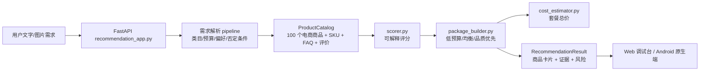

# 新人阅读指南与当前架构

项目现在是传统电商智能导购，不再是 AI API 商城。读代码时先抓住一句话：后端只从本地 100 个已上架商品中做 RAG/规则召回、评分和套装推荐，然后以流式事件返回给 Web 调试台和未来 Android 原生端。

## 先读什么

1. `README.md`
   - 看项目目标、接口和 Android 商品卡片字段。

2. `rag/schemas/recommendation.py`
   - `RequirementSpec`：购物需求结构化结果。
   - `ApiProduct`：兼容旧命名的电商商品模型，优先看 `product_id/title/brand/price/image_url`。
   - `RecommendationPlan`：低预算、均衡、品质优先三套方案。

3. `rag/api/recommendation_app.py`
   - FastAPI 入口、SSE、附件解析、商品列表接口。
   - 重点看 `/api/review-requirement`、`/api/stream-recommend`、`/api/products`。

4. `rag/recommendation/*`
   - `product_loader.py`：读取 `data/ecommerce_products/products.json`。
   - `recommendation_pipeline.py`：规则/LLM 购物需求解析。
   - `scorer.py`：商品可解释评分。
   - `package_builder.py`：生成三套购物方案。
   - `cost_estimator.py`：汇总 SKU 价格为套餐总价。

5. `data/ecommerce_products`
   - `products.json`：100 个规范化商品。
   - `images/`：100 张商品图，后端挂载到 `/product-images/*`。
   - `manifest.json`：导入来源和类目统计。

## 当前架构

Milvus 现在不是主依赖。默认 `RECOMMENDATION_ENABLE_MILVUS=false`，系统依靠结构化商品库即可完整跑通。后续如果要增强 RAG，可把商品 FAQ、评价、详情写入向量库，让 `retrieval.py` 给评分加证据加权。

## 数据口径

旧 API 相关数据已经下架：

- `data/api_products`
- `data/api_docs`
- `data/price_rules`
- `data/raw`
- 旧 Milvus 本地状态

保留的数据：

- `data/ecommerce_agent_dataset_供参考.zip`
- `data/ecommerce_products/products.json`
- `data/ecommerce_products/images/*`

数据集没有精确库存字段。后端用 `stock_status=available_for_demo` 表示演示上架，不声明真实库存数量。任何交易闭环都应在加购/下单前刷新真实库存和最终成交价。

## 一次请求怎么走

1. Web/Android 发送用户需求到 `/api/review-requirement` 或 `/api/stream-recommend`。
2. `goal_with_attachment_context()` 把图片/PDF 解析摘要补进需求上下文。
3. `parse_requirement()` 解析出：
   - `desired_categories`
   - `price_max`
   - `must_have_terms`
   - `excluded_terms`
   - `need_bundle`
   - `need_comparison`
   - `need_multimodal`
4. `load_product_catalog()` 加载 100 个商品并建立 `by_id/by_category`。
5. `score_products()` 过滤否定条件并评分。
6. `build_plan()` 生成低预算、均衡、品质优先三套方案。
7. `/api/stream-recommend` 依次推送 `step/requirement/catalog/plans/guidance/result/done`。

## 常见测试问题

- “200 元以下蓝牙耳机”如果数据集中没有预算内耳机，系统会明确提示没有严格满足预算的上架商品，并返回最接近候选，不会假造低价商品。
- “不要含酒精的防晒”会进入 `excluded_terms`，候选过滤和评分会避开命中否定词的商品。
- “三亚度假，从防晒到穿搭”会触发 `need_bundle=true`，并组合美妆护肤 + 服饰运动。
- “上传街拍照片找同款外套”会触发 `need_multimodal=true` 和 `input_modalities=["text","image"]`，第一版仍用文本化图片摘要进入召回。
