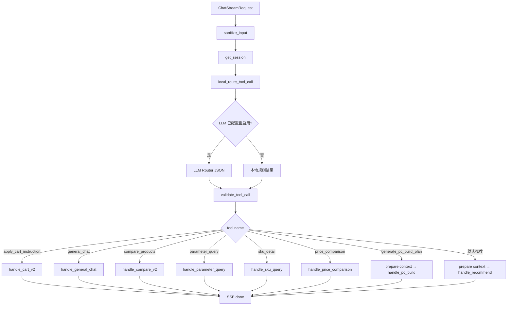
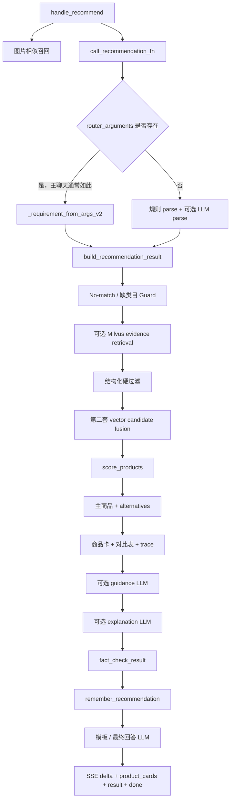
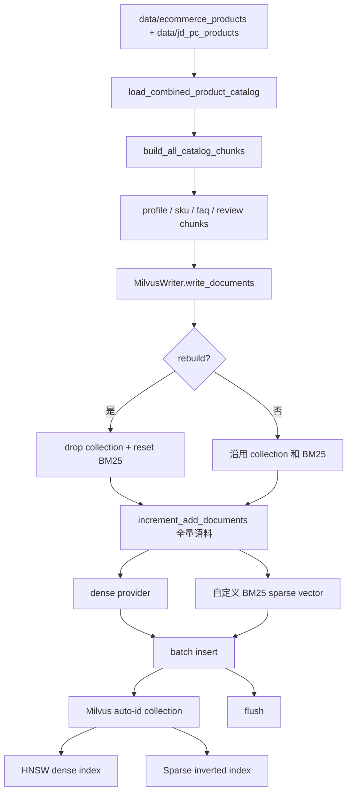
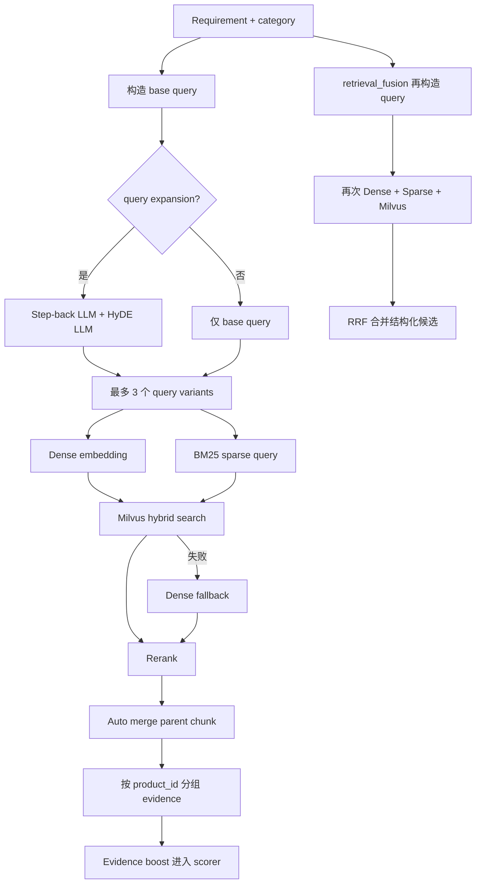
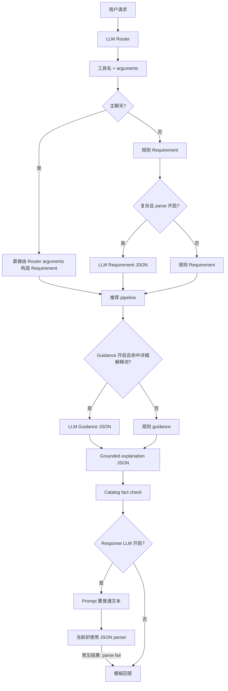
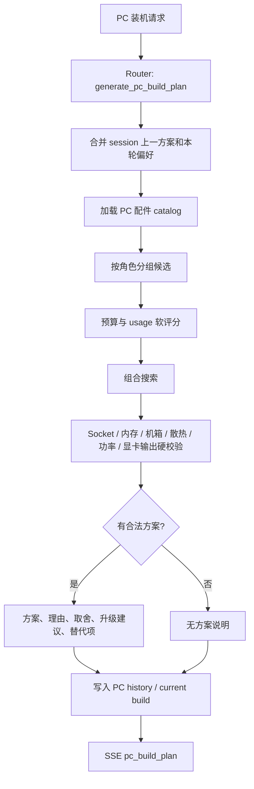
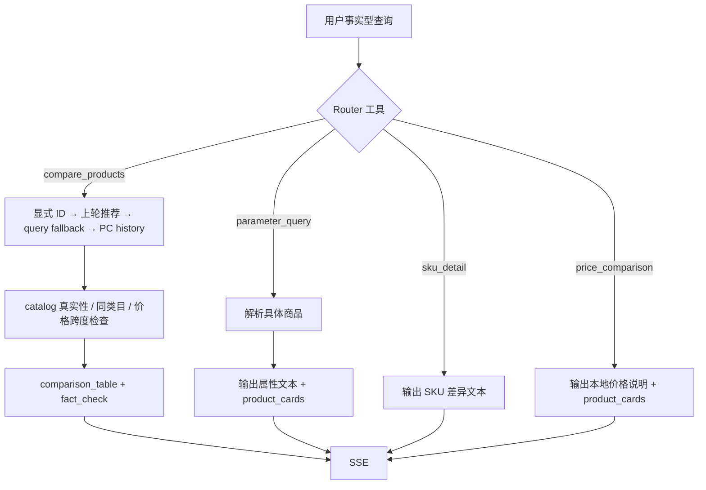
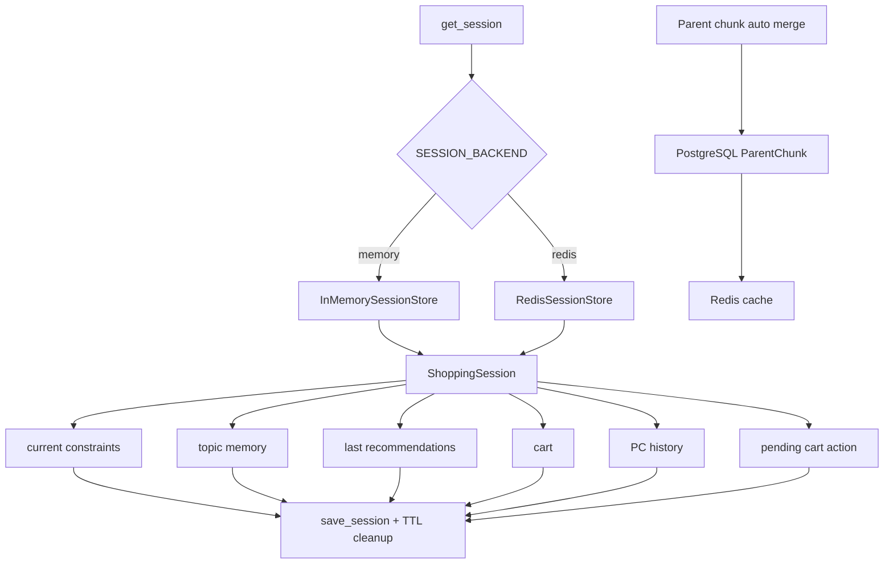
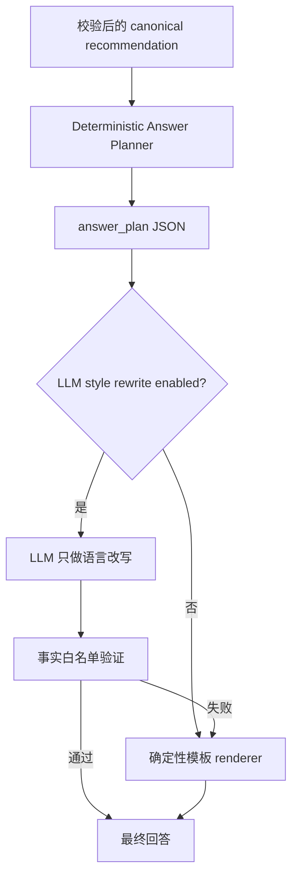
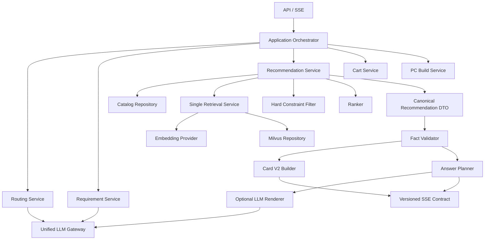

# MallMind 当前项目代码审查报告

> 审查日期：2026-06-17  
> 审查范围：`rag/`、`frontend/`、`scripts/`、核心测试、公开配置与仓库内已有评估结果  
> 重点：死代码、完整业务链路、Embedding/RAG、大模型链路、商品卡、最终回答  
> 结论性质：静态代码审查 + 离线回归验证；未在本次审查中调用外部 LLM/Embedding 服务或重建 Milvus。

## 1. 执行摘要

项目已经具备一套较完整的电商导购 Demo：主入口明确、结构化商品库能独立兜底、PC 装机有硬兼容校验、SSE 事件覆盖推荐/对比/购物车/PC 方案，Embedding 与 LLM 也都有失败降级设计。

但当前实现的主要问题不是“能力不够多”，而是同一能力存在多套并行实现，导致链路事实与文档描述、配置项、测试和前端协议逐渐分叉。最值得优先处理的结论如下：

1. **线上 RAG 的 hybrid hit 解析很可能取错层级。** `hybrid_retrieve()` 直接读取 `hit.text/product_id`，而同文件 dense 分支和健康脚本都从 `hit.entity` 读取。真实 MilvusClient 返回嵌套 `entity` 时，hybrid 命中会变成“有 hit、无 product_id/文本”，证据无法进入评分。
2. **一次推荐会发生两次独立向量召回。** 第一套用于 evidence boost，第二套用于 candidate fusion；两套分别生成 embedding、连接 Milvus、构造不同 query/filter，增加延迟和结果不一致风险。
3. **向量候选可以绕过结构化硬过滤。** `fuse_candidates()` 把 vector-only 商品直接并回规则候选，之后没有重新执行品牌排除、子类目、关键词等硬约束。
4. **最终回答的 LLM 成功分支存在协议错误。** Prompt 要求输出普通文本，但代码用 `chat_json_with_report()` 解析；正常文本会因 JSON 解析失败而回退模板，因此“LLM 自然回答”实际上很难成功。
5. **主 SSE 链路会绕过独立的 LLM requirement parse。** `/api/chat/stream` 总会传 `router_arguments`，pipeline 因而走 `_requirement_from_args_v2()`；这条路径还丢弃 `need_bundle`、`usage`、字典型 `preferences` 等 Router 已抽取字段。
6. **商品卡后端 DTO 与前端期望不匹配。** 后端推荐卡是轻量字段，前端详情却期望 `tags/skus/reviews/faqs/metadata.specs/description`；推荐卡打开详情时优先使用轻量卡，不会补拉完整商品，导致详情空洞。
7. **`product_cards` SSE 事件有两种 payload。** 主推荐发 `products`，参数查询/比价/对比降级发 `cards`，前端只读取 `data.products`，后几条链路的卡片会静默丢失。
8. **前端存在明确的覆盖型死代码。** `renderProductCard` 定义 3 次，`renderProductDetailPanel` 和 `bindProductButtons` 各 2 次，前面的实现会被最后一个同名声明覆盖。
9. **运行模式与配置存在漂移。** 请求里的 `mode` 未参与选择，主链路始终标记 `balanced`；文档/`.env.example` 使用 `RECOMMENDATION_*`，主聊天却读取若干 `MALLMIND_*` 同义开关。
10. **现有评估尚未证明 RAG/LLM 提升推荐主指标。** 仓库内消融报告显示多组 top1 基本一致；当前更应先修“链路可观测、协议一致、只召回一次”，再继续堆模型调用。

建议按以下顺序治理：

- **P0（先修正确性）**：hybrid hit 解析、SSE 卡片协议、最终回答文本/JSON 协议、vector-only 硬约束复检。
- **P1（再修架构和成本）**：合并两套 RAG 召回、统一 Router/Requirement schema、统一环境变量和 runtime mode、修复索引幂等与 BM25 原子性。
- **P2（最后做体验）**：商品卡 V2、详情懒加载、回答 planner + renderer、统一 LLM Gateway、清理死代码与陈旧测试。

## 2. 审查方法与验证结果

本次执行了以下检查：

- 枚举项目源文件、API 路由、顶层定义与跨文件引用。
- 从 `POST /api/chat/stream` 向下追踪全部 handler、session、推荐、检索、LLM、卡片和 SSE 消费。
- 从商品 JSON 向上追踪 chunk、dense/sparse embedding、Milvus schema、写入、hybrid/dense 检索、证据融合与评分。
- 对 Python 顶层定义做低引用静态扫描，并逐项用全文引用复核，避免把 FastAPI 路由或动态导出误判为死代码。
- 检查 JavaScript 同名函数覆盖与 SSE payload 消费。
- 运行前端语法检查：`node --check frontend/app.js`，通过。
- 运行离线核心回归（排除集成服务）：**131 passed，5 failed**。
- 另有 `tests/test_recommendation_llm.py` 在收集阶段失败：仍从 `rag.api.recommendation_app` 导入已迁移符号 `goal_with_attachment_context`。

5 个离线失败分别暴露：runtime trace 字段漂移、session contextual goal 预期漂移、多模态标记未进入 Requirement、legacy cart contract 漂移、`parse_adjustment_amount` 迁移后测试仍引用旧位置。它们不全是线上 bug，但共同说明测试与当前模块边界没有同步。

本次未验证：真实 LLM 成功率、DashScope 实时 embedding、Milvus 在线 hybrid 返回结构、Redis/PostgreSQL 连通性。仓库内现有 `reports/vector_index_health.json` 记录 collection 存在、884 行、dense dim=1024、dense/sparse 索引完成，但 provider 网络请求失败，smoke query 未执行。

## 3. 项目总览与主链路

### 3.1 总体架构

```mermaid
flowchart TD
    U[用户 / Web 调试台] --> FE[frontend/app.js]
    FE -->|POST /api/chat/stream| CHAT[FastAPI chat_stream]
    FE -->|图片预分析| ATTAPI[/api/analyze-attachments]
    FE -->|商品市场| PRODUCTS[/api/products]
    FE -->|直接购物车| CARTAPI[/api/cart/actions]
    FE -->|直接对比| CMPAPI[/api/products/compare]

    CHAT --> CTX[输入清洗 + Session + 附件上下文]
    CTX --> ROUTER[本地 Router + 可选 LLM Router + Guard]
    ROUTER --> H1[普通推荐]
    ROUTER --> H2[商品对比]
    ROUTER --> H3[购物车]
    ROUTER --> H4[PC 整机]
    ROUTER --> H5[参数 / SKU / 比价]
    ROUTER --> H6[普通聊天]

    H1 --> CATALOG[本地结构化商品库]
    H1 --> RAG[可选 Embedding + Milvus RAG]
    H1 --> SCORE[过滤 + 融合 + 打分 + 商品卡]
    H1 --> FACT[Catalog 事实校验]
    H1 --> ANSWER[模板 / 可选 LLM 最终回答]

    H4 --> PCDATA[本地 PC 配件库]
    H4 --> PCCHECK[预算搜索 + 兼容性硬校验]

    H1 --> SSE[SSE events]
    H2 --> SSE
    H3 --> SSE
    H4 --> SSE
    H5 --> SSE
    H6 --> SSE
    SSE --> FE
```

### 3.2 API 链路清单

| 入口 | 实际用途 | 主要下游 | 状态判断 |
|---|---|---|---|
| `POST /api/chat/stream` | 正式主入口 | Router → handlers → SSE | 主链路 |
| `POST /api/chat` | 旧非流式协议 | `legacy_chat_compat` | 兼容链路，默认可配置关闭 |
| `POST /api/recommend` | 单次非流式推荐 | parse → pipeline | 测试/Smoke |
| `GET /api/stream-recommend` | 图式推荐事件 | `RecommendationGraph` | 调试旁路 |
| `POST /api/analyze-intent` | 规则解析需求 | attachment context → rule parse | 辅助接口 |
| `POST /api/review-requirement` | 强制 LLM 解析需求 | LLM parse → 追问 | 辅助接口 |
| `POST /api/finalize-prompt` | 拼接需求和追问 | attachment normalization | 辅助接口 |
| `POST /api/analyze-attachments` | 图片分析 | Vision LLM / metadata fallback | 可选增强 |
| `GET/POST/PUT /api/products...` | 商品浏览与受控写入 | 本地商品 JSON | 独立商品链路 |
| `POST /api/products/compare` | 直接结构化对比 | catalog lookup | 独立对比链路 |
| `POST /api/cart/actions` | 直接购物车操作 | session store | 独立购物车链路 |
| `POST /api/cart/confirm` | 确认待执行购物车计划 | pending action → mutation | 主聊天补充链路 |
| `POST /api/pc-build/generate` | 直接 PC 方案 | PC generator | 独立 PC 链路 |
| `POST /api/feedback` | 记录反馈 | feedback store | 独立反馈链路 |
| `/health`、`/api/runtime/diagnostics`、`/api/llm/diagnose` | 健康与诊断 | catalog/LLM/Redis/Milvus/DB | 运维链路 |

## 4. 全部业务链路图

### 4.1 主 SSE 路由与分发



注意：`ChatStreamRequest.mode` 当前没有进入上述决策，事件固定输出 `mode=balanced`。

### 4.2 普通商品推荐链路



### 4.3 Embedding 建索引链路



这里有两个幂等性问题：非 rebuild 重跑会再次累加 BM25 文档统计；collection 使用 auto-id，重跑会插入重复 chunk，而不是按稳定 `chunk_id` upsert。

### 4.4 在线 Embedding / RAG 链路



`M→N` 和 `O→Q` 是两套重复召回。目标架构应让一次检索同时产出 `ranked_product_ids + evidence_by_product_id`。

### 4.5 大模型调用链路



补充调用：图片附件使用 Vision LLM；General Chat 使用文本 LLM；Query Expansion 可再调用 Step-back 和 HyDE 两次模型。理论上一次 full 请求可能触发 Router、Parse、Guidance、Explanation、Response、Step-back、HyDE 多次调用，但主聊天的 Parse 又常被 Router arguments 绕过，当前链路既贵又不稳定，而且可观测字段难以解释真实贡献。

### 4.6 图片与多模态链路

```mermaid
flowchart TD
    A[浏览器图片] --> B[/api/analyze-attachments]
    B --> C{Vision LLM 可用?}
    C -- 是 --> D[摘要 / OCR / visual attributes / query terms]
    C -- 否 --> E[metadata-only fallback]
    D --> F[前端移除 data_url 后发送 chat]
    E --> F
    F --> G[prepare_recommendation_context]
    G --> H[goal_with_attachment_context]
    F --> I[本地 PixelImageEmbedding]
    I --> J[data/image_vectors.json cosine search]
    J --> K[图片 evidence]
    H --> L[文本推荐]
    K --> L
```

当前图片向量是 61 维像素颜色/纹理特征，不是 CLIP/SigLIP 语义向量；适合做离线可测试的近似图像召回，不应对外描述成高质量“看图识货”。

### 4.7 PC 整机链路



PC 链路是当前最“结构化优先”的部分，方向正确。它与普通推荐 RAG 共享的主要是数据集和单配件替换，不依赖 LLM 才能完成核心兼容性判断。

### 4.8 购物车链路

```mermaid
flowchart TD
    A[购物车意图] --> B[Guard 强制 apply_cart_instruction]
    B --> C[handle_cart_v2]
    C --> D{操作}
    D -->|clear| E[直接清空]
    D -->|add/remove/set_quantity| F[解析商品与数量]
    F --> G{是否歧义}
    G -- 是 --> H[cart_clarification]
    G -- 否 --> I[生成 pending action + 60s TTL]
    I --> J[cart_confirmation]
    J --> K[/api/cart/confirm]
    K -->|确认| L[apply_cart_instruction]
    K -->|取消/过期| M[清除 pending action]
    E --> N[save_session + cart SSE]
    L --> N
    H --> O[done]
    M --> O
```

另有 `POST /api/cart/actions` 直接修改链路，以及旧 `handle_cart()`。正式主聊天使用 v2，旧 handler 已不可达。

### 4.9 对比、参数、SKU、比价链路



问题在于 `G/I` 发送 `{"cards": ...}`，主推荐发送 `{"products": ...}`，前端只消费后者。

### 4.10 Legacy、Graph 与直接接口旁路

```mermaid
flowchart LR
    A[/api/chat] --> B[legacy_chat_compat]
    C[/api/recommend] --> D[非流式 recommendation pipeline]
    E[/api/stream-recommend] --> F[RecommendationGraph]
    G[/api/review-requirement] --> H[强制 LLM parse]
    I[/api/pc-build/generate] --> J[直接 PC generator]
    K[/api/products/compare] --> L[直接 catalog compare]

    B -. 与主 SSE 协议不同 .-> M[兼容消费者]
    D -. 与主 SSE Router 不同 .-> N[测试 / smoke]
    F -. 独立事件协议 .-> O[图式调试]
```

这些旁路不是严格死代码，因为路由仍注册且测试/脚本可能调用；但它们显著扩大维护面。建议明确保留期限，并让公共业务能力复用同一 application service，而不是各自拼装流程。

### 4.11 Session 与持久化链路



会话主链路并不使用 ORM 的 `User/ChatSession/ChatMessage` 三张表；PostgreSQL 当前主要服务 ParentChunk auto-merge。`init_db()` 没有被应用启动调用，部署需要外部迁移/初始化保证表存在。

## 5. 重点问题清单

### P0-1：Hybrid 检索结果字段读取层级不一致

**证据**

- `rag/storage/milvus_client.py:323-344`：hybrid 分支从 `hit.get("text")`、`hit.get("product_id")` 读取。
- `rag/storage/milvus_client.py:380-400`：dense 分支从 `hit.get("entity", {})` 读取。
- `scripts/check_vector_index_health.py:200-213`：健康脚本也从 `entity` 读取。

**影响**

- hybrid search 可能返回非空 hits，但格式化后的 `product_id/text/title` 全空。
- `EvidenceRetriever` 会丢弃没有 `product_id` 的 hit。
- candidate fusion 也无法把向量命中映射回 catalog。
- trace 可能显示 raw hit > 0，但 `matched_product_ids` 为空，形成误导。

**建议**

增加统一 `_normalize_hit(hit)`，兼容 `entity` 嵌套和扁平结构；hybrid、dense、health check 共用。新增不依赖 Milvus 的单元测试，分别输入两种返回结构并断言所有业务字段。

### P0-2：Vector-only 候选绕过硬约束

**证据**

- `package_builder.py:466-477` 先做结构化过滤，再调用 `fuse_candidates()`。
- `retrieval_fusion.py:197-205` 从完整 catalog 映射 vector product。
- `retrieval_fusion.py:267-277` 直接把 rule 与 vector 候选合并，没有再次执行硬过滤。

**影响**

排除品牌、排除关键词、精确子类目、库存或其他结构化限制可能被 vector-only 商品绕过。后置预算只过滤商品卡价格，不能覆盖所有约束。

**建议**

RAG 只负责召回，不负责豁免约束。统一流程应为：`union recall → hydrate catalog product → hard filter once → score/rerank`。如果保留“召回补充”，vector-only 商品也必须通过同一个 predicate，并在 trace 标记 rejected reason。

### P0-3：最终回答 LLM 使用了错误的输出协议

**证据**

- `response_generator.py:122-136` 要求“只输出回复文本”。
- `response_generator.py:160-179` 却调用 `chat_json_with_report()` 并期待字典中的 `content/text`。
- `llm_client.py:223-238` 的 `chat_json_with_report()` 会对模型文本执行 `json.loads()`。

**影响**

模型遵从 Prompt 输出自然文本时会解析失败，随后静默回退模板。当前“LLM-first”注释与实际成功路径不一致。

**建议**

两种方案选一：

1. 简单方案：改用 `chat_text()`，再做事实白名单校验。
2. 推荐方案：要求固定 JSON `{"answer":"...","mentioned_product_ids":[]}`，继续使用 JSON parser，并校验回答中的商品名、价格、库存只来自 card facts。

### P0-4：`product_cards` SSE 协议不一致

**证据**

- 主推荐：`tool_handlers.py:909` 发送 `products`。
- 对比降级、参数、比价：`tool_handlers.py:501/669/750` 发送 `cards`。
- 前端：`frontend/app.js:337-339` 只读取 `data.products`。

**影响**

参数查询、比价和部分对比降级明明发了商品卡，前端却显示为空；这是静默失败，不会报错。

**建议**

定义一个版本化事件：

```json
{
  "schema_version": "product_cards.v2",
  "cards": []
}
```

所有生产者和消费者只使用 `cards`。过渡期前端可临时读 `data.cards || data.products || []`。

### P1-1：同一请求执行两次 Embedding/Milvus 召回

第一套在 `retrieve_requirement_evidence()` 生成 evidence；第二套在 `retrieval_fusion._vector_recall()` 生成候选。两者 query 拼接、top-k、filter、trace 和异常处理均不同。

**影响**：延迟翻倍、embedding 成本翻倍、连接检查重复、两套结果不一致、超时后后台线程仍可能继续工作。

**建议**：设计单一 `RetrievalResult`：

```text
query_variants
ranked_product_ids
evidence_by_product_id
scores_by_product_id
filter/retrieval/postprocess trace
```

候选融合和 evidence boost 只消费这一个结果。

### P1-2：主聊天绕过 LLM parse，且 Router 字段映射丢失

`recommend_shopping_products()` 只要收到 `router_arguments` 就不调用 `parse_requirement()`。主聊天每次都会传 Router arguments，因此 requirement parse LLM 主要只在 `/api/recommend`、`/api/review-requirement`、graph 等旁路工作。

同时 `_requirement_from_args_v2()`：

- 只接受 list 型 `preferences`，而 `RoutedArguments.preferences` 定义为 dict；结果通常被清空。
- 没有映射 `usage`、`need_bundle`、`need_comparison`、`excluded_terms`、多模态标记等。
- `build_requirement_parse_trace()` 仍可能记录 `llm_parse_requested=True`，但并没有真正尝试 parse。

**建议**：只保留一个 `RequirementSpec` 构造器。Router 负责工具选择；结构化约束由规则 parser 与可选 LLM parser 合并。若为了延迟复用 Router JSON，也应让 Router 输出与 `RequirementSpec` 完全同构，并通过同一 Pydantic schema 校验。

### P1-3：环境变量命名漂移

主聊天读取：

- `MALLMIND_GUIDANCE_LLM`
- `MALLMIND_MILVUS_RETRIEVAL`
- `MALLMIND_RAG_QUERY_EXPANSION`

公开配置与 pipeline 读取：

- `RECOMMENDATION_LLM_GUIDANCE`
- `RECOMMENDATION_ENABLE_MILVUS`
- `RECOMMENDATION_QUERY_EXPANSION`

结果是修改 `.env.example` 中的 documented flag，不一定改变 `/api/chat/stream` 行为。

**建议**：建立单一 `Settings` 对象，在应用启动时解析并校验；禁止业务模块 import 时各自读取环境变量。诊断接口直接输出最终 resolved policy，而不是原始 env。

### P1-4：Runtime mode 是展示值，不是实际策略

请求模型有 `mode=auto`，README 描述 auto→fast/balanced/full，但主路由固定返回 `balanced`，也没有 `selected_runtime_mode`。相关离线测试已失败。

**建议**：实现明确策略表，或暂时从 API/README 删除 mode。不要输出一个未真正控制 Router、RAG、LLM、Vision 的模式名。

### P1-5：索引写入不是幂等、BM25 状态不是事务性的

- BM25 在任何 Milvus insert 前先持久化全量统计。
- 插入失败后只能提示“请全量重建”，无法回滚状态。
- 非 rebuild 重跑全量索引会重复累加统计。
- Milvus 主键是 auto-id，稳定 `chunk_id` 不是主键，重复运行会产生重复行。

**建议**：构建 `next_bm25_state` 和新 collection，完成后用 alias 切换；或使用 `chunk_id` 主键 upsert。collection metadata 记录 provider/model/dim/corpus hash/BM25 state hash，查询时全部校验。

### P1-6：自定义 Sparse 算法不等同于标准 BM25

当前文档和 query 都使用相同 BM25-like 权重，再以 IP 做点积，会重复叠加 IDF 与长度/TF 影响；中文按单字切词也容易让高频字主导稀疏召回。

**建议**：优先采用 Milvus 官方 BM25/full-text 能力，或使用成熟中文 analyzer；如果保留自定义 sparse，应在离线集上单独评估 sparse-only、dense-only、hybrid，并校准融合权重。

### P1-7：硬超时不会真正停止后台任务

`run_with_hard_timeout()` 启动 daemon thread，超时只是主线程停止等待；底层网络请求会继续到 socket timeout。RAG 的 `ThreadPoolExecutor.shutdown(wait=False)` 同理，running future 无法 cancel。

**影响**：高并发和 provider 变慢时，超时请求会继续占线程、连接和额度。

**建议**：统一使用可取消的异步 HTTP client 和 request deadline；至少保证 socket timeout ≤ hard timeout，并用全局 semaphore 限制所有 LLM call，而不只是 Router。

### P1-8：事实校验只修 product_cards，不同步 plans/comparison

`fact_check_result()` 可以删除卡片或改价格，但 `plans`、`comparison_table`、`cost_estimate`、先前生成的 explanation 仍保留旧值。最终文本基于修正后卡片，`result` 的其他结构却可能不一致。

**建议**：事实校验前移到 DTO 构建之前；最终所有派生视图都从校验后的 canonical selected products 生成。

## 6. 死代码与冗余实现审查

### 6.1 已确认的死代码/覆盖代码

| 位置 | 证据 | 建议 |
|---|---|---|
| `frontend/app.js:420-445` | `renderProductCard` 后续又定义两次 | 删除前两个，只保留一个实现 |
| `frontend/app.js:447-483` | 同名函数又被 `:548` 覆盖 | 与最终版本合并后删除 |
| `frontend/app.js:485-546` | `renderProductDetailPanel` 被 `:586` 覆盖 | 删除重复版本 |
| `frontend/app.js:946-959` | `bindProductButtons` 被 `:961` 覆盖 | 删除旧版本 |
| `frontend/app.js:1373-1376` | `renderImage` 被 `:1378` 覆盖 | 删除一个 |
| `tool_handlers.py:38-49` | 主链路使用 `handle_cart_v2`，旧 `handle_cart` 无调用 | 删除或移入 legacy 模块 |
| `tool_handlers.py:416-431` | 主链路使用 `handle_compare_v2`，旧 `handle_compare` 无调用 | 删除或移入 legacy 模块 |
| `tool_handlers.py:1036` | `build_chat_delta_lines` 无调用，已由 response generator 替代 | 删除并更新注释 |
| `recommendation_pipeline.py:183` | `_requirement_from_args` 已被 v2 替代，无调用 | 删除 v1 |
| `package_builder.py:940` | `average` 无调用 | 删除 |
| `scorer.py:561` | `average` 无调用 | 删除 |
| `handler_base.py:91/106` | 两个 helper 无调用；文件中仅 `trace_span` 在用 | 删除 helper，缩小模块职责 |
| `llm_gateway.py` | 生产代码无任何导入，仅自述示例和架构测试引用 | 要么真正接入全部 LLM call，要么删除，不应维持“假的统一层” |
| `scripts/backfill_pc_images.py` | 明确声明 deprecated no-op | 删除或移入 `scripts/legacy/` |

### 6.2 仅作为公共导出存在、仓库内无调用

以下符号只在 `rag/recommendation/__init__.py` 重导出，仓库生产代码和测试没有实际调用：

- `cost_estimator.attach_cost_estimates`
- `package_builder.build_plan` 兼容 wrapper
- `product_loader.load_products`
- `product_loader.filter_pc_parts_catalog`

如果没有仓库外消费者，应在一个 deprecation 周期后删除。若确有外部消费者，应补 API stability 文档和契约测试，不能仅凭 `__all__` 长期保留。

### 6.3 Dormant / 兼容代码，不建议直接判死

| 位置 | 当前角色 | 处理建议 |
|---|---|---|
| `rag/utils/rag_utils.retrieve_documents` | 旧通用文档 RAG 入口；其 query expansion helper 仍被使用 | 拆分 query expansion，删除旧 retrieve 或移 legacy |
| `rag/storage/database.init_db` | 应用未调用，可能由外部部署执行 | 用 Alembic/启动检查替代隐式假设 |
| ORM `User/ChatSession/ChatMessage` | 当前 API session 不使用，只有 `ParentChunk` 被 auto-merge 使用 | 若短期无账号/消息持久化计划，迁移到 future/legacy |
| `/api/chat`、`/api/recommend`、`/api/stream-recommend` | 路由可达，但不属于正式客户端主链路 | 标注 owner、消费者、下线日期 |
| `rag/legacy/` | 只有空包说明 | 删除空目录或放入真正 legacy 实现 |

### 6.4 测试与脚本资产冗余

`tests/` 中混有大量 `debug_*`、`trace_*`、`diag_*`、`quick_*`、临时复测脚本和正式 pytest。它们会增加“看似有很多覆盖，实际上 CI 不收集或已过期”的错觉。

建议整理为：

```text
tests/unit/
tests/integration/
tests/contract/
tests/eval/
tools/debug/        # 非 pytest 临时诊断
archive/            # 已完成的一次性复测
```

并确保 CI 至少运行：主 SSE contract、所有 handler 的 product_cards contract、hybrid hit normalization、Router→Requirement 字段保真、最终回答事实白名单。

## 7. 商品卡专项优化方案

### 7.1 当前问题

后端 `product_card_from_component()` 只提供：ID、标题、品牌、类目、价格、图片、库存、评分、reason、score、source、selected SKU ID。

前端商品卡/详情却读取：`tags`、`best_for`、`supported_scenarios`、`skus`、`reviews`、`faqs`、`metadata.specs`、`description`。主推荐卡缺少这些字段，因此：

- 卡片标签通常为空。
- SKU 数显示默认 1，并不代表真实情况。
- 点击详情后仍使用轻量卡，评价、FAQ、规格为空。
- `reason` 是一段包含综合分和“召回分”的技术文案，不适合面向用户。
- `stock_status` 直接显示内部英文枚举。
- 主卡和备选卡没有明确 rank/primary/取舍结构。

### 7.2 建议的 Card V2

```json
{
  "schema_version": "product_card.v2",
  "product_id": "...",
  "rank": 1,
  "role": "primary",
  "title": "...",
  "brand": "...",
  "category": {"key": "digital", "label": "数码电子", "sub_category": "真无线耳机"},
  "price": {"current": 399, "min": 399, "max": 499, "currency": "CNY", "is_realtime": false},
  "availability": {"status": "available", "label": "有货", "quantity_known": false},
  "image": {"url": "/product-images/...", "alt": "..."},
  "rating": {"value": 4.7, "count": 1234},
  "selected_sku": {"sku_id": "...", "label": "黑色 / 标准版", "price": 399},
  "highlights": ["续航长", "支持降噪", "预算内"],
  "tradeoffs": ["不含实时优惠", "耳型适配建议试戴"],
  "why_it_fits": ["满足 500 元预算", "符合通勤降噪需求"],
  "evidence": [{"type": "catalog", "label": "参数"}, {"type": "review", "label": "评价摘要"}],
  "actions": ["detail", "compare", "add_to_cart"]
}
```

### 7.3 数据传输策略

- SSE 只传轻量 Card V2，不把完整 reviews/FAQ 全塞入首屏。
- 点击详情时调用 `GET /api/products/{product_id}`，前端缓存结果。
- Card 内提供 2-3 个由结构化字段生成的用户语言 highlights；不要展示内部 `final_score=0.8231` 和 `召回分=...`。
- 对比按钮应进入“选择对比对象”状态，不应默认拿当前卡加前 3 张卡自动比较。
- 统一 PC 卡和普通商品卡的基础视觉协议，PC 用 `spec highlights` 替代图片即可。

### 7.4 商品卡验收指标

- 100% 推荐卡能打开完整详情。
- 所有 handler 产出的 `product_cards.v2` contract test 通过。
- 卡片中商品 ID、价格、SKU、库存状态与 catalog 一致率 100%。
- 首屏每卡只显示 3 个最有决策价值的字段，详情再展开规格/FAQ/评价。
- 用户点击“对比/加购/详情”的事件可追踪，作为后续 rerank 反馈。

## 8. 最终回答专项优化方案

### 8.1 当前问题

- 主链路先发送固定 opening：“我先按你的需求筛一遍……”，随后又发送自然回答，语义重复。
- LLM response 的文本/JSON 协议错误，常回退模板。
- 模板随机选择，测试难以稳定复现；并含“性价比很高”“品牌缺货”等未必有事实支撑的表述。
- `grounded_explanation` 已生成，却只放在 `feedback_summary`，最终用户回答未真正消费。
- Guidance、Explanation、Response 可能连续三次生成，职责重叠。
- 回答是单个完整 delta，不是真正 token streaming，却在 UI 中呈现为流式链路。

### 8.2 推荐目标架构：Answer Plan → Renderer



建议 `answer_plan` 固定包含：

```json
{
  "intent": "recommendation",
  "headline": "预算内首选",
  "primary_product_id": "...",
  "facts": [
    {"type": "price", "value": 399},
    {"type": "fit", "value": "满足通勤降噪需求"}
  ],
  "tradeoffs": ["价格和库存不是实时数据"],
  "alternatives": ["..."],
  "next_actions": ["查看详情", "加入购物车", "对比前两款"]
}
```

LLM 只允许把这些事实改写成自然语言，不参与选品、不新增事实。回答后做以下校验：

- 提到的商品名/ID必须在 cards 中。
- 所有价格必须等于 card price 或明确标记区间。
- 不允许输出“缺货/有货/优惠/最便宜”等没有对应事实的词。
- 没有卡片时只能使用 no-match plan。

### 8.3 推荐回答结构

普通单品推荐控制在 3 段：

1. **结论**：首选哪一款，价格多少。
2. **为什么**：2 个与用户约束直接对应的理由。
3. **取舍 + 下一步**：1 个风险，提示可详情/对比/加购。

不要在文本里重复卡片上已经清晰展示的完整参数表。PC 方案则使用“总价—核心组合—兼容性—升级路径”四段。

### 8.4 LLM 调用合并建议

- Router：只做工具选择和最少 slots。
- Requirement parser：只在规则不确定时调用一次。
- Explanation 与 Response 合并为一次 `answer_plan rewrite`，不要连续调用两次。
- Query expansion 默认关闭，只有离线评估证明召回提升时按 category 开启。
- General chat 可单独走 fast model，但必须共享统一 Gateway、deadline、semaphore、trace。

## 9. 推荐目标架构



关键原则：一个 canonical recommendation 作为唯一事实源；卡片、对比表、购物车动作、最终回答都从它派生。RAG 只召回一次，LLM 只在明确职责边界内调用。

## 10. 分阶段优化路线图

### 第一阶段：1-3 天，修正确性

1. 修复 Milvus hybrid hit normalization，并补 unit test。
2. `product_cards` 统一为 `cards`，前端临时兼容双字段。
3. response generator 改用正确文本调用或严格 JSON schema。
4. vector-only 候选重新经过硬过滤。
5. 删除前端重复函数，保证只有一个 renderer/binder。
6. 修复 `tests/test_recommendation_llm.py` 陈旧导入和 5 个离线失败。

**完成标准**：核心离线测试全绿；每个 handler 的卡片都能显示；hybrid mock hit 能产出 product_id；LLM response mock 能走成功分支。

### 第二阶段：3-7 天，收敛链路

1. 合并 `retrieval.py` 与 `retrieval_fusion.py` 的重复召回。
2. 统一 Router→Requirement schema，保真映射全部字段。
3. 建立 `Settings` 与真实 runtime policy。
4. 事实校验前移，统一生成 card/comparison/answer。
5. 为 LLM 调用接入真正统一 Gateway、并发限制和可取消 deadline。
6. 索引改为稳定 chunk 主键和幂等 upsert/alias swap。

**完成标准**：一次 category 只生成一次 query embedding；trace 能解释每个候选来源、过滤原因和 RAG 是否改变排名。

### 第三阶段：1-2 周，提升产品体验

1. 上线 Card V2 与详情懒加载。
2. 上线 Answer Plan + grounded renderer。
3. 建立点击、详情、对比、加购反馈指标。
4. 重新做 dense/sparse/hybrid/rerank 消融，要求证明业务 uplift。
5. 把 debug/eval/legacy 资产分目录，删除确认无外部消费者的死代码。

**完成标准**：相比 fast baseline，RAG 在有效样本的 hit@5、P@1 或业务转化代理指标至少有一项稳定提升，同时 P95 延迟在目标范围内。

## 11. 建议新增的关键测试

| 测试 | 目的 |
|---|---|
| `test_hybrid_hit_entity_normalization` | 防止真实 Milvus hit 被格式化为空 |
| `test_vector_only_candidate_must_pass_hard_constraints` | 防止 RAG 绕过品牌/类目/否定条件 |
| `test_one_embedding_call_per_category` | 防止重复召回回归 |
| `test_router_arguments_roundtrip_to_requirement` | 确保 usage/preferences/need_bundle 等不丢失 |
| `test_response_llm_plain_text_or_json_contract` | 确保 LLM 最终回答成功路径可达 |
| `test_response_fact_whitelist` | 防止回答编造名称/价格/库存 |
| `test_all_product_card_events_share_v2_schema` | 统一所有 handler 的 SSE contract |
| `test_card_detail_lazy_load` | 推荐卡能补齐完整详情 |
| `test_runtime_mode_controls_policy` | mode 与 Router/RAG/LLM/Vision 开关一致 |
| `test_index_rebuild_is_idempotent` | 重跑不产生重复 chunk/BM25 漂移 |

## 12. 最终判断

当前项目的强项是结构化商品库、PC 兼容规则和多 handler 业务覆盖；短板集中在“同一能力的多套实现没有收敛”。现阶段不建议继续增加更多 LLM 节点或新的 RAG 技巧。先把以下四件事做实，收益最大：

1. 让一次检索真正产生可用、可追踪的 product evidence。
2. 让硬约束在任何召回来源下都不可绕过。
3. 让商品卡和最终回答共享同一份校验后事实。
4. 让生产链路、配置、测试、文档描述的是同一个系统。

完成这些后，再评估 CLIP/SigLIP、reranker、query expansion 或更强模型，才容易看见真实提升，而不是被链路漂移和 fallback 掩盖。
