**纯文本可见版主链路图**：

```text
┌──────────────────────────────────────────────┐
│ 1. 用户输入                                   │
│ Query / 图片 / Session ID                     │
└───────────────────────┬──────────────────────┘
                        │
                        ▼
┌──────────────────────────────────────────────┐
│ 2. /api/chat/stream                           │
│ 主聊天入口，负责 SSE 流式响应                 │
└───────────────────────┬──────────────────────┘
                        │
                        ▼
┌──────────────────────────────────────────────┐
│ 3. Preprocess                                 │
│ 清洗文本、处理附件、图片摘要、输入规范化       │
└───────────────────────┬──────────────────────┘
                        │
                        ▼
┌──────────────────────────────────────────────┐
│ 4. Session Context Builder                    │
│ 构造 compact memory                           │
│ 包括 topic_memory / last_result / cart        │
│ pc_build_history / recent_turns_summary       │
└───────────────────────┬──────────────────────┘
                        │
                        ▼
┌──────────────────────────────────────────────┐
│ 5. Local Route + Rule Parse                   │
│ 本地路由打分、规则需求解析                    │
│ 产出 route_confidence / margin / 初步需求      │
└───────────────────────┬──────────────────────┘
                        │
                        ▼
┌──────────────────────────────────────────────┐
│ 6. Adaptive Runtime Selector                  │
│ 根据置信度、复杂度、历史依赖、LLM 状态决定链路 │
└───────────────┬───────────────┬──────────────┘
                │               │
        ┌───────▼───────┐ ┌────▼────────┐
        │ fast           │ │ balanced    │
        │ 简单高置信      │ │ 中等复杂度   │
        │ 规则链路        │ │ LLM 解析/解释│
        └───────┬───────┘ └────┬────────┘
                │              │
        ┌───────▼───────┐ ┌────▼────────┐
        │ full           │ │ degraded_fast│
        │ 复杂/图片/详细 │ │ LLM故障降级   │
        │ query expansion│ │ 规则兜底      │
        └───────┬───────┘ └────┬────────┘
                │              │
                └──────┬───────┘
                       ▼
┌──────────────────────────────────────────────┐
│ 7. Guard / Clarification / Catalog Gap        │
│ 主动澄清、unsupported、safety、missing_subcat │
│ budget_catalog_gap、filtered_empty            │
└───────────────────────┬──────────────────────┘
                        │
                        ▼
┌──────────────────────────────────────────────┐
│ 8. 工具分支                                   │
└──────┬──────────┬──────────┬──────────┬──────┘
       │          │          │          │
       ▼          ▼          ▼          ▼
┌──────────┐ ┌──────────┐ ┌──────────┐ ┌──────────┐
│普通推荐  │ │商品对比  │ │PC整机方案│ │购物车操作│
│Recommend │ │Compare   │ │PC Build  │ │Cart      │
└────┬─────┘ └────┬─────┘ └────┬─────┘ └────┬─────┘
     │            │            │            │
     └────────────┴─────┬──────┴────────────┘
                        ▼
┌──────────────────────────────────────────────┐
│ 9. 保存 Session + Trace                       │
│ 保存 last_requirement / last_result / cart    │
│ tool_history / runtime / fallback / evidence  │
└───────────────────────┬──────────────────────┘
                        │
                        ▼
┌──────────────────────────────────────────────┐
│ 10. SSE Response                              │
│ progress / delta / product_cards / table      │
│ follow_up_questions / result / done           │
└──────────────────────────────────────────────┘
```

更紧凑一点，就是：

```text
User Query
  ↓
/api/chat/stream
  ↓
Preprocess
  ↓
Session Context Builder
  ↓
Local Route + Rule Parse
  ↓
Adaptive Runtime Selector
  ├─ fast
  ├─ balanced
  ├─ full
  └─ degraded_fast
        ↓
Guard / Clarification / Catalog Gap
        ↓
Tool Branch
  ├─ Recommendation Pipeline
  ├─ Compare Pipeline
  ├─ PC Build Pipeline
  ├─ Cart Pipeline
  └─ General Chat
        ↓
Save Session + Trace
        ↓
SSE Response
```

如果你还想用 Mermaid，可以用下面这个更兼容的版本。它去掉了 `<br/>`，节点也加了引号，渲染成功率更高：

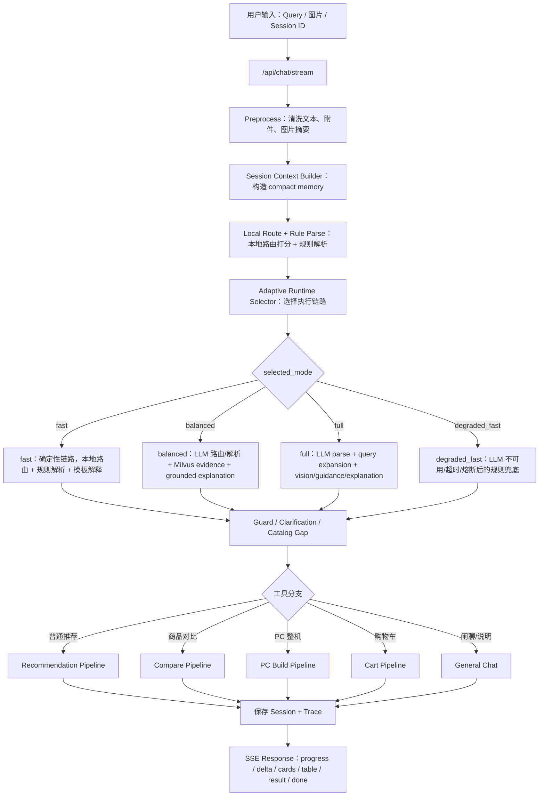

对你这个项目来说，主链路最重要的理解是：

`/api/chat/stream` 不是直接推荐商品，而是先读取 session、清洗输入、构造上下文，再通过本地规则获得路由置信度，然后由 adaptive runtime 决定本轮该用 fast、balanced、full 还是 degraded_fast。之后所有分支都要先过 guard，普通推荐走结构化过滤 + RAG evidence + scoring，对比走 comparison table + grounded explanation，PC 整机走独立 PC build，本轮完成后统一保存 session 和 trace，最后通过 SSE 返回给前端。
完成这次大修后，项目链路应该从“固定 auto≈balanced 的推荐管线”，变成“每轮 query 自适应选择执行强度的导购 Agent 管线”。

核心原则可以压缩成一句话：

**LLM 负责理解、澄清、解释；商品事实、商品筛选、最终商品卡片必须来自 catalog / ApiProduct / RAG evidence / structured_filter，不由 LLM 编造。**

当前项目已有本地路由、guard、structured_filter、SSE handler、Milvus evidence、session、评估脚本等基础；这次大修是在这些基础上补 adaptive runtime、compact session memory、clarification guard 和 grounded explanation。现有 `tool_router.py` 已经有本地路由评分、LLM router 跳过、timeout、熔断和 guard；`structured_filter.py` 已有评分前确定性过滤；`tool_handlers.py` 已经是 `/api/chat/stream` 的 SSE 执行层。  

---

## 1. 总体链路图

完成后，主链路应该长这样：

```mermaid
flowchart TD
    A[用户输入 Query / 图片 / Session ID] --> B[/api/chat/stream]
    B --> C[Preprocess<br/>清洗文本、附件、图片摘要]
    C --> D[Session Context Builder<br/>构造 compact memory]
    D --> E[Local Route + Rule Parse<br/>本地路由打分 + 规则需求解析]
    E --> F[Adaptive Runtime Selector<br/>决定 fast / balanced / full / degraded_fast]

    F --> G{selected_mode}

    G -->|fast| H1[确定性链路<br/>本地路由 + 规则解析 + 模板解释]
    G -->|balanced| H2[平衡链路<br/>LLM route/parse 可用 + Milvus evidence + 可选 grounded explanation]
    G -->|full| H3[增强链路<br/>LLM parse + query expansion + vision/guidance/explanation]
    G -->|degraded_fast| H4[降级链路<br/>LLM 不可用/超时/熔断后规则兜底]

    H1 --> I[Guard / Clarification / Catalog Gap]
    H2 --> I
    H3 --> I
    H4 --> I

    I --> J{工具分支}
    J -->|普通推荐| K[Recommendation Pipeline]
    J -->|商品对比| L[Compare Pipeline]
    J -->|PC 整机| M[PC Build Pipeline]
    J -->|购物车| N[Cart Pipeline]
    J -->|闲聊/说明| O[General Chat]

    K --> P[保存 Session + Trace]
    L --> P
    M --> P
    N --> P
    O --> P

    P --> Q[SSE Response<br/>progress / delta / cards / table / result / done]
```

你可以把它理解成三层。

第一层是**入口与上下文层**：拿到用户输入后，不急着推荐，而是先读取 session，构造 compact memory。这里会包含当前主题、最近几轮摘要、上一轮推荐、购物车、PC 装机历史等。

第二层是**自适应决策层**：先跑本地路由和规则解析，得到路由置信度、需求完整度、历史依赖和复杂度，再决定这轮到底用 fast、balanced、full，还是 degraded_fast。

第三层是**业务执行层**：普通推荐、对比、PC 装机、购物车、闲聊分别走不同 pipeline。推荐与对比最终都必须过结构化过滤和事实校验。

---

## 2. Adaptive Runtime 选择逻辑

大修后，`auto` 不应该再等价于固定 `balanced`。它应该变成真正的 adaptive selector。

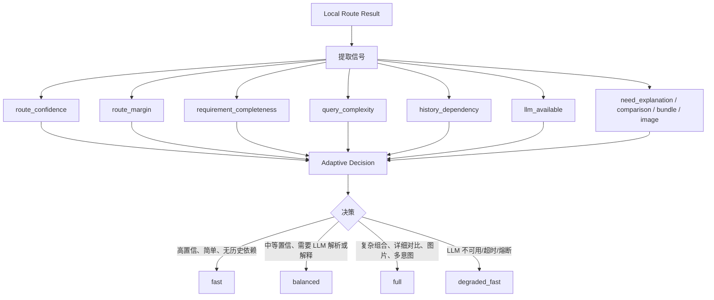

四种模式的职责应该是：

| 模式              | 触发条件                            | 使用能力                                                                   | 不允许做什么                |
| --------------- | ------------------------------- | ---------------------------------------------------------------------- | --------------------- |
| `fast`          | 本地路由高置信、query 简单、需求完整           | 本地路由、规则解析、结构化过滤、catalog scoring、模板解释                                   | 不调用 LLM，不让向量/LLM 扩散需求 |
| `balanced`      | 中等复杂度、需要 LLM 辅助解析或解释            | LLM router/requirement parser、Milvus evidence、LLM grounded explanation | 不让 LLM 生成商品事实         |
| `full`          | 复杂多意图、图片、组合、详细对比、失败后继续细化        | query expansion、vision、LLM parse、LLM explanation、RAG 后处理               | 不绕过 structured_filter |
| `degraded_fast` | LLM 不可用、超时、JSON invalid、熔断、测试环境 | 复用 fast 的规则链路，trace 标记 fallback                                        | 不崩溃，不泄露底层错误           |

关键点是：**degraded_fast 不是一个必须大改 runtime enum 的新执行分支，它可以内部复用 fast policy，但 trace 要显示 selected_mode=degraded_fast、fallback_used=true、fallback_reason=xxx。**

---

## 3. 普通推荐链路

普通推荐应该是这次大修后的主链路。

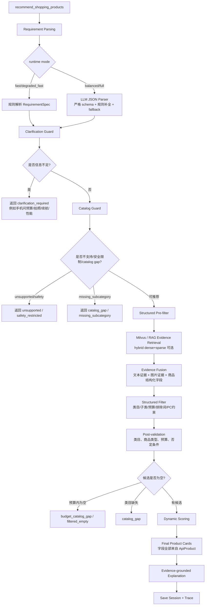

这里有几个重要变化。

第一，**“推荐一款手机”不会直接硬推**。它会被 clarification guard 拦住，返回类似：

“你更看重拍照、续航、性能还是性价比？预算大概是多少？”

第二，**catalog gap 不会再被邻近商品填充**。例如“洗面奶”不存在时，不能拿防晒、面霜、精华冒充；“外套”不存在时，不能拿户外裤、背包、帽子冒充。

第三，**预算严格性要变强**。当前 `structured_filter.py` 已经会在预算过滤为空时记录 `relaxed_constraints`，但大修后应该默认不放宽硬预算，只有用户说“可以贵一点”“看看相近价位”时才放宽。

第四，**LLM explanation 不影响商品选择**。商品卡片先由结构化链路确定，然后 LLM 只基于白名单字段解释为什么推荐。

---

## 4. 对比链路

当前项目的 `handle_compare()` 主要是 `compare_products()` 生成表格，然后直接返回。大修后应该变成“结构化比较 + grounded explanation”两段式。

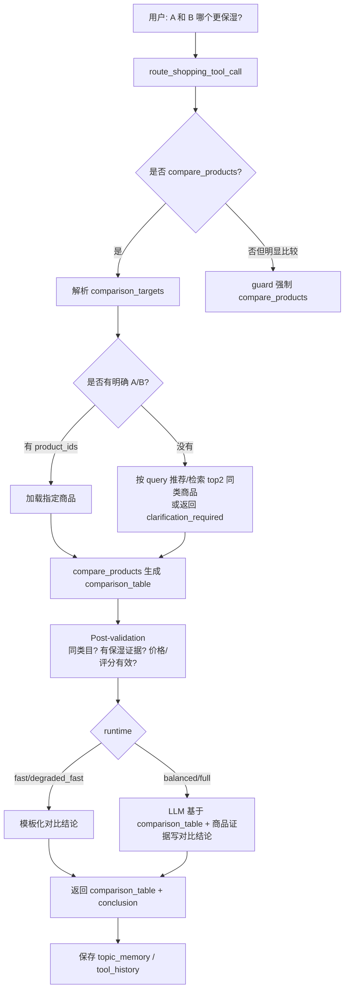

对比链路最关键的是：**LLM 不能直接说“某商品更保湿”而没有证据**。它只能看到 comparison table、商品 FAQ、review 摘要、best_for/not_good_for、score_breakdown、evidence_chunks，然后输出：

```json
{
  "winner": "...",
  "why": "...",
  "evidence_points": [],
  "tradeoff": "...",
  "caveat": "..."
}
```

如果用户说“帮我比较两款面霜哪个更保湿”，但没给具体两款，允许两种产品设计：

一是自动找 top2 面霜做比较；二是返回澄清：“请指定两款，或让我先从商品库里挑两款代表产品比较。”比赛 demo 里我更建议第一种，因为更像 Agent。

---

## 5. PC 整机链路

PC 整机不应该混进普通商品推荐，它仍然走独立本地结构化规划器。

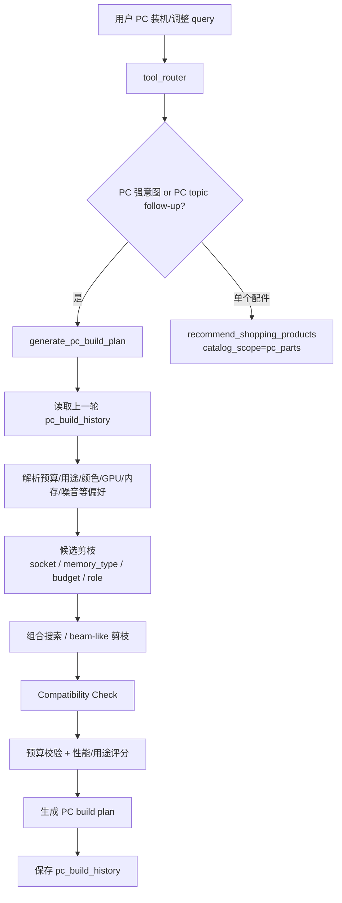

大修后，PC 的重点不是让 LLM 重新规划整机，而是让 LLM 在 balanced/full 下做“解释增强”：

“为什么这套更适合 2K 游戏？”
“换成 4070 后预算为什么上升？”
“降到 6000 后牺牲了哪些部分？”

但配件选择仍然由结构化兼容性和预算规则决定。

---

## 6. 购物车链路

购物车链路应该保持确定性，不需要 LLM 决策。

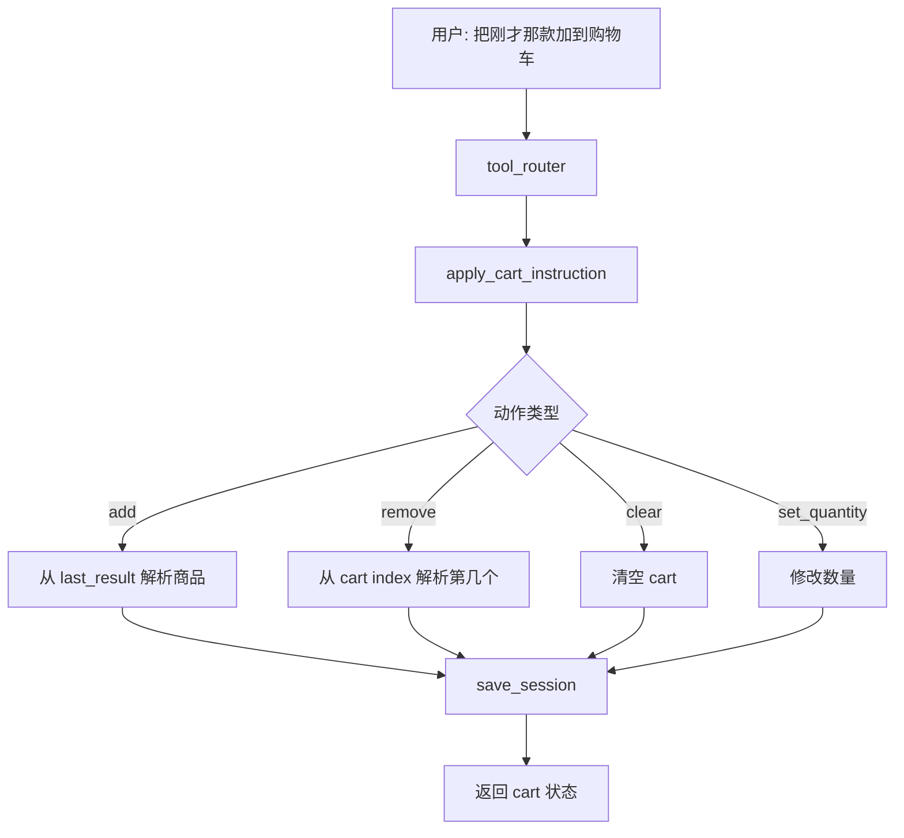

这里主要依赖 `last_result` 和 `cart`。如果 session 没有上一轮推荐，“刚才那款”必须返回澄清或错误提示，而不是随便加商品。

---

## 7. Session Compact Memory 链路

这次大修后，session 不只是保存 `last_goal`，而是变成“短期工作记忆”。

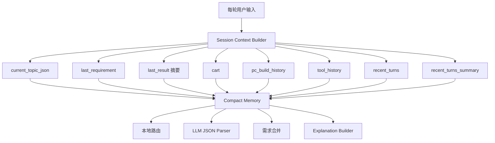

多轮跑鞋例子应该这样流动：

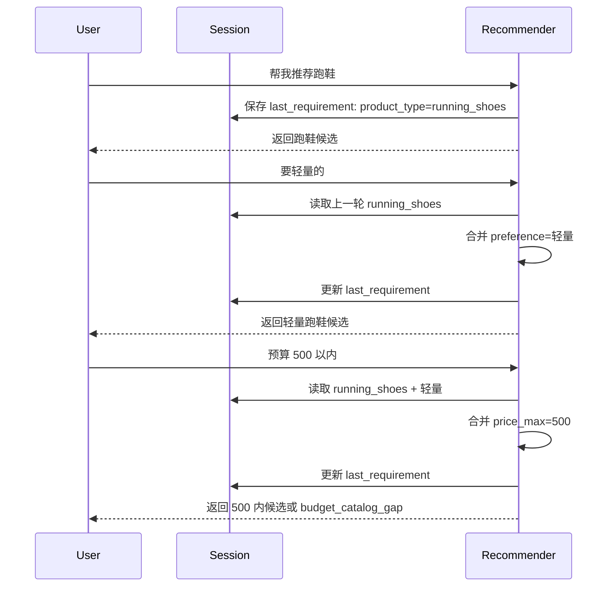

主题切换则要断开继承：

```text
上一轮 topic = 跑鞋
用户新 query = 再推荐一款手机
=> 新 topic
=> 不继承 跑鞋/轻量/500 元 约束
```

---

## 8. LLM JSON Parser 的位置

LLM JSON parser 不应该替代本地规则，而是“规则初稿 + LLM 修正 + guard 校验”。

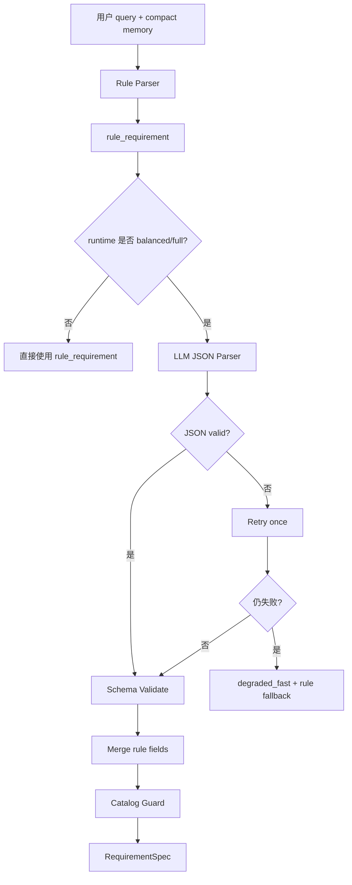

这层的强约束是：

LLM 只能输出结构化需求，例如 category、product_type、budget、positive_attributes、negative_attributes、comparison_targets、clarification_questions。它不能输出最终商品，也不能编造 product_id。

---

## 9. Evidence-grounded Explanation 链路

大修后推荐解释应单独成为一个 builder，而不是散落在模板里。

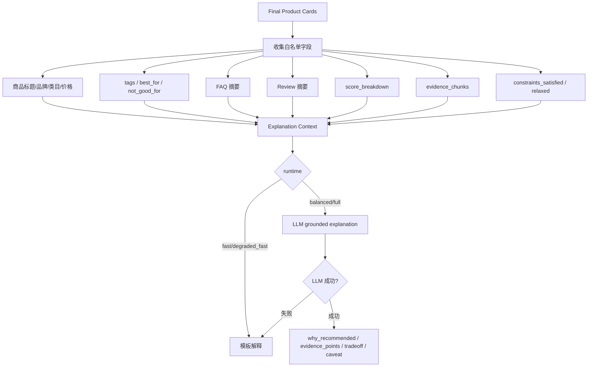

这一步的核心不是“让回答更花哨”，而是让导购解释变成可控的、可验收的模块。它应输出：

```json
{
  "why_recommended": [],
  "evidence_points": [],
  "constraint_explanation": "",
  "tradeoff": "",
  "caveat": ""
}
```

如果 LLM 说了上下文里不存在的价格、成分、SKU、评价，就应该被测试判为 hallucinated field。

---

## 10. Trace 应该长什么样

完成大修后，每轮 result trace 至少能回答这几个问题：

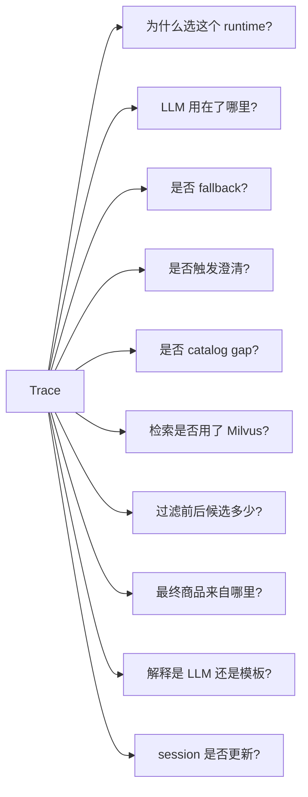

理想 trace 字段大致如下：

```json
{
  "requested_runtime_mode": "auto",
  "selected_runtime_mode": "balanced",
  "adaptive_decision": {
    "reason_codes": ["comparison_request", "needs_evidence_grounded_explanation"],
    "route_confidence": 0.72,
    "route_margin": 0.18,
    "requirement_completeness": 0.68,
    "query_complexity": 0.55,
    "history_dependency": 0.2,
    "fallback_used": false
  },
  "llm_used_for_route": true,
  "llm_used_for_parse": true,
  "llm_used_for_explanation": true,
  "clarification_required": false,
  "catalog_guard_result": "ok",
  "retrieval_used": true,
  "milvus_used": true,
  "pre_filter": {},
  "post_validate": {},
  "candidate_count_before": 100,
  "candidate_count_after": 4,
  "selected_product_ids": ["..."],
  "explanation_mode": "llm_evidence_grounded",
  "session_updated": true,
  "sanitized_errors": []
}
```

生产环境要继续 sanitize，不能把 API key、endpoint、堆栈路径暴露给前端。

---

## 11. 用几个典型 query 串起来看

### 场景一：“推荐一款手机”

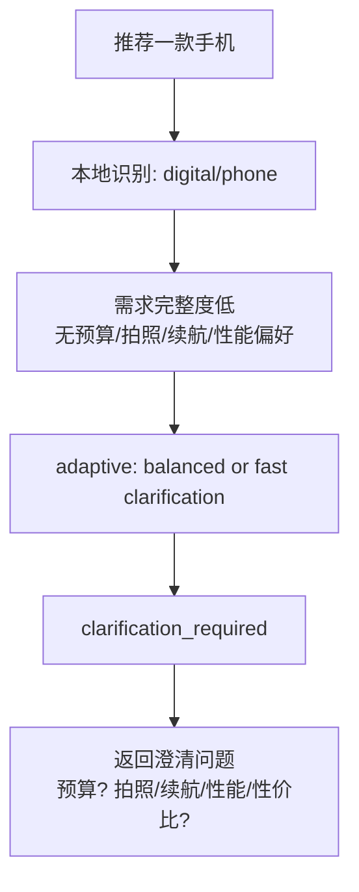

结果：不直接推荐。

---

### 场景二：“200 元以下的蓝牙耳机有哪些？”

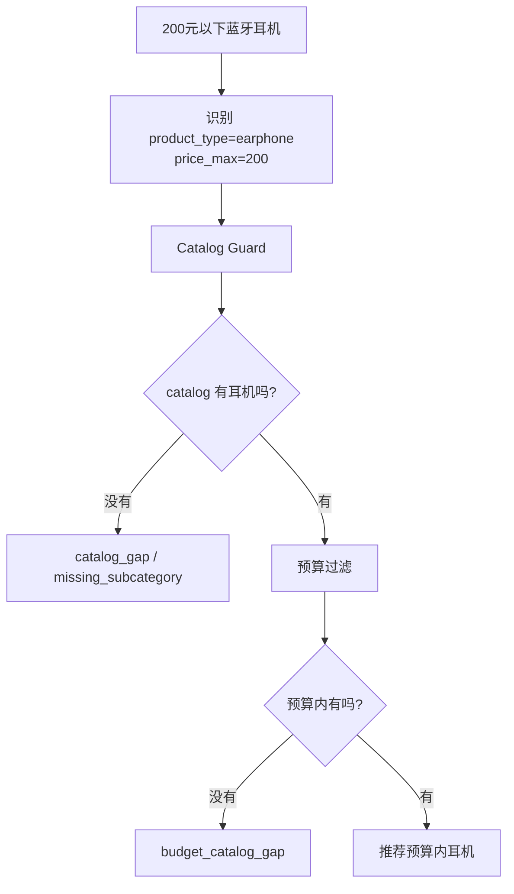

结果：不能用手机、平板冒充耳机。

---

### 场景三：“帮我比较两款面霜哪个更保湿”

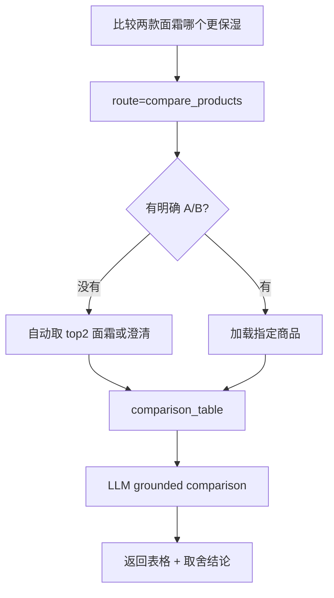

结果：不退化成普通推荐列表。

---

### 场景四：“推荐防晒霜，但不要含酒精，也不要日系品牌”

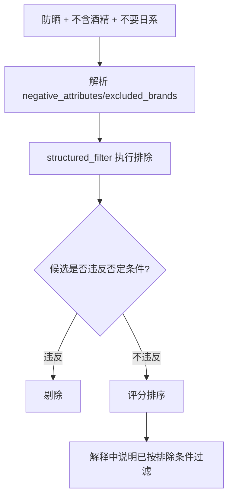

结果：LLM 不能绕过过滤。

---

### 场景五：“三亚度假，从防晒到穿搭，预算 800”

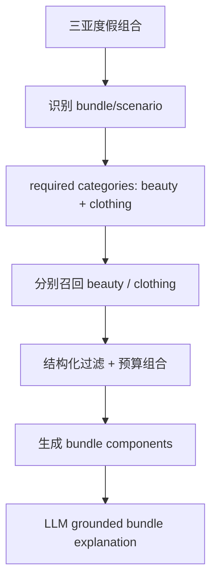

结果：不是单品推荐，而是组合方案。

---

## 12. 最终链路的本质变化

大修前，项目更像：

```text
query -> router -> recommend/compare/pc/cart -> result
```

大修后，项目应该变成：

```text
query + compact session
-> local signal extraction
-> adaptive runtime decision
-> guarded structured parsing
-> clarification/catalog gap guard
-> structured retrieval/filter/scoring
-> fact-locked product cards
-> evidence-grounded explanation
-> trace + session update
```

也就是说，项目从“能推荐商品的 RAG 应用”，升级成“可解释、可降级、可评估的电商导购 Agent”。

这对比赛展示更有利，因为你可以明确讲：

“我们的 Agent 不是把商品选择交给大模型，而是让大模型只参与高价值环节：复杂需求理解、澄清、对比解释和导购表达。最终商品事实始终受 catalog、结构化过滤、RAG evidence 和后验校验约束。”
