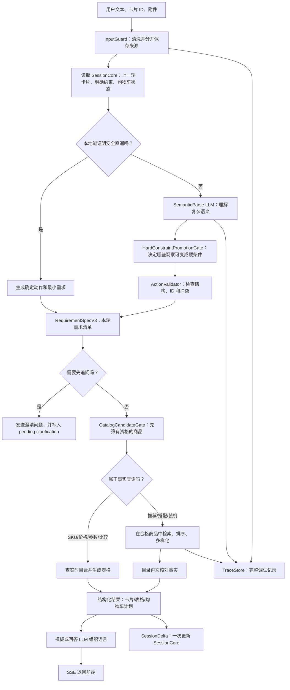

# V3 最终系统应是什么样：用一条清晰链路解释整个项目

> 这份文件不讲改代码的顺序，而是讲改造完成后，一条用户消息会经过哪些模块、哪些模块有权做什么、哪些模块绝对不能做什么。想看施工步骤请读 `v3_refactor_implementation_plan.md`；想看具体对话样例请读 `v3_multiturn_information_flow.md`。

## 1. 用一句话描述 V3

V3 是一个多轮电商导购系统：**LLM 负责听懂复杂人话，目录和规则负责做事实判断，检索负责在合格商品里排序，会话只保存下一轮需要的少量信息。**

这四件事必须分开。否则模型会把猜测当事实，检索会把用户明确不要的商品找回来，会话会越聊越大且越来越混乱。

## 2. 用户发出一句话后，完整链路是什么



这张图里最重要的两句话：

1. **先确认商品有没有资格，再做向量搜索。** 价格、库存、品牌排除、类目等硬条件不应该靠相似度决定。
2. **先得到结构化事实，再生成自然语言。** LLM 可以说得更自然，但不能给目录里没有的 SKU、价格或参数。

## 3. 每个模块到底负责什么

### 3.1 InputGuard：只清洗，不理解购物意图

InputGuard 做的是输入卫生：去零宽字符、统一空格和换行、限制长度、拦截明显注入、分开用户正文和附件文字。它不负责理解“这是不是手机”，也不负责删掉“不要”“512G”等有业务意义的词。

输出的 `NormalizedTurn` 包含请求 ID、清洗文本、附件引用和安全事件。它让后续模块面对的是稳定输入，而不是每个模块各自再做一次不一致的清洗。

### 3.2 SessionCore：只保存用户下一句话可能引用的东西

SessionCore 应该可以直接回答以下问题：

- 用户刚才看过哪几张商品卡？“第二个”是哪一个？
- 当前聊天是在聊哪个明确话题（手机、平板、PC、购物车）？刚才的“第二个”属于哪个话题？
- 用户明确说过哪些预算、类目、品牌包含/排除？
- 当前正在问哪一个 SKU？
- 是否存在尚未确认的加购计划？
- 系统刚问了什么澄清问题；用户下一句“对”具体在确认什么？

它不应该保存检索 chunk、完整模型回答、附件 OCR、模型日志或几十轮原文。那些信息进入 TraceStore，供调试而不是供下一轮做业务判断。会话还应保存 `active_topic`（话题 ID、域、当前卡片索引、最近有效业务轮次）和最多 3 个 `recent_topics` 短摘要；它们只用于识别“第二个”“刚才那台手机”，不是把旧对话全文重新塞给模型。

当系统需要追问时，SessionCore 必须短期保存一个 `pending_clarification`，它是带类型的 ClarificationPlan：问题 ID、追问类型、完整问题、允许选项、答案格式、尚未生效的草案字段、来源请求和过期时间。它可以问“要手机还是平板”“更看重拍照还是游戏”“预算上限多少”“要放宽哪个条件”，不只是“对不对”。

下一轮优先按 `clarification_id` 和该 plan 的 `answer_schema` 解析：用户点“平板”就直接写分类，点“拍照”只写软偏好，输入“3000 以内”写硬价格上限，输入“3000 左右”只写软价格目标。只有 `confirm_draft` 类型才接受“对/是”；确认只认可用户看见过的字段。文本不匹配选项或附带新业务条件时，才在受限字段范围内调用 SemanticParse。确认、取消、超时或新话题都会清除 pending state，避免把“对”或“平板”错误接到旧问题上。

### 3.3 本地 RuleSignal：只负责证明简单请求安全

本地解析器不是为了和 LLM 比谁更懂中文，而是为了处理无需语义推理的确定场景：

- 前端给了 card ID/product ID/SKU ID；
- 用户说“第二个 512G 有没有”，第二个能从会话卡片中唯一找到；
- 用户说“第一和第二个比较一下”，两张卡都存在；
- 用户对一个尚未过期的购物车计划说“确认”；
- 用户只说“推荐手机”，其中“手机”在分类表中唯一对应手机目录范围。

它不是按“有没有复杂关键词”判断，而是按固定顺序做一个小型、确定的解析：先验证前端 card/product/SKU ID 和购物车确认 token，再用与数据库共用的统一词表把分类、品牌、型号、SKU 和属性归一到 canonical ID，最后解析动作句式、卡片序号、包含/排除、预算/数量/容量。`华为/HUAWEI/huawei` 必须得到同一个 `brand_family_id=huawei`；`pad/Pad/平板` 只要在目录词表里唯一登记，就都得到 `product_type_id=tablet`。每次匹配都保留原文位置和来源。否定词必须先计算覆盖范围：`不要给我推荐手机` 中的“手机”处于被否定的“推荐手机”短语内，不能被错误当成正向手机类目。解析结束后，系统检查是否还留下有业务意义但没处理的文字；例如“给妈妈用”“或许”“上一台”都不能当作礼貌词忽略。

只有命中少量受支持的完整 grammar、枚举后只得到一个可执行**语义组**、每个操作符作用域明确、实体/引用唯一、grammar 所需业务 schema 完整，且没有未处理业务片段时，才允许本地直通。`推荐手机，3000 元以内，不要小米，拍照优先` 可以直通，因为它完整匹配 `recommend.category_constraints.v1`；`给妈妈买个简单的` 不可以，因为“给妈妈/简单”没有唯一的机器含义；`不要只推荐小米` 也不可以，尽管每个词都可能命中词表，本地不能把它错组装为“排除小米”。`不要给我推荐手机，3000 元以内，pad不错，来点推荐` 中的 `pad` 会唯一归一为 `tablet`，但该词序和“不错”不属于 V1 grammar；系统应调 SemanticParse 理解推荐意图，却不应反过来问用户“想买什么品类”。完整规则、数据结构和测试矩阵以施工说明的 [4.2 节](v3_refactor_implementation_plan.md#42-本地规则只做安全白名单不做中文万能理解器) 为唯一准则。

每次本地直通都必须带 `safety_proof`。这是一份机器可检查的理由，例如：

```json
{
  "action": "parameter_query",
  "operation": "sku",
  "target": {"card_id": "c_17", "product_id": "p_205"},
  "safety_proof": {
    "grammar_id": "target.sku.v1",
    "grammar_version": "1.0",
    "parse_tree": {"target": "c_17", "storage_gb": 512, "question": "sku"},
    "valid_parse_count": 1,
    "semantic_group_count": 1,
    "semantic_unique": true,
    "semantic_signature": "sha256:...",
    "operator_scopes_resolved": true,
    "unresolved_operators": [],
    "proof_version": "rule-proof-v1",
    "session_lookup": "display_index=2 -> c_17",
    "unresolved_spans": [],
    "entities_unique": true,
    "references_unique": true,
    "business_schema_complete": true,
    "conflicts": [],
    "allowed": true
  }
}
```

`unresolved_spans=[]` 只是必要条件，不是放行证明。只要没有完整 grammar、枚举后存在两个不同的可执行语义组、操作符范围不明、多个候选、冲突或目标失效，`allowed=false`，转给 LLM 或直接问一个确定的缺失问题。重点不是列出所有复杂表达，而是默认不放行。

### 3.4 SemanticParse LLM：只理解复杂人话，输出受限 JSON

对“给妈妈买个简单好用、拍照也不错的”“同事推荐小米但我用得不好，也许华为适合我”这种话，本地不应该猜。SemanticParse LLM 读取：清洗后的本轮文字、有限的会话摘要、分类/品牌/属性字典可选项。它输出的是受 schema 限制的 JSON，而不是直接回答用户。

它要回答的是：

- 用户想做什么：推荐、问参数、比较、购物车还是闲聊？
- 商品品类是否确定？
- 哪些条件是用户明确命令，哪些只是偏好或叙事？
- 哪些信息不够，最少要追问什么？

它不能回答的是：“给用户推荐 product_123”“这台现在 2999 元”“这款有 512G”。这些必须由后面的目录查询决定。

### 3.5 HardConstraintPromotionGate：明确命令和明确不喜欢才能变成过滤条件

LLM 自己不能把一句话直接写成 hard 条件。它只能提交带原文位置的“语义观察”；PromotionGate 回到本轮清洗文本或前端 UI 数据，检查是否存在批准的明确命令句式。

例如，“不要小米”“别给我小米”“只要华为”、前端勾选“排除小米”，以及目标唯一、没有模态/条件/反转的“小米用得不好”，都可以升级为硬过滤；“或许华为适合我”只留作软的正向排序偏好。明确负面不再走 soft avoid：它会写入分类/品牌/商品/型号/SKU 等对应的类型化黑名单，直到用户明确说同一个对象“也可以”才释放。PromotionGate 不需要理解全部中文情绪，它只做保守的准入：范围不清、含“也许/可能/如果/听说”、或同句反转就不升级。每一条 hard 条件必须记录 `promotion_source` 和 `promotion_rule_id`。

### 3.6 ActionValidator：只检查结构事实，不假装理解中文语义

ActionValidator 不再负责判断“也许”的语义。它检查：

- 动作和 mode 是否属于 4 个允许动作；
- PromotionGate 产出的分类、品牌、属性、价格是否在字典和范围内；
- LLM 提到的卡片和商品是否真的存在且属于当前会话；
- 比较目标数量、购物车数量、确认 token 是否正确；
- hard 条件是否冲突，且每条 hard 是否有 promotion 来源和规则 ID。

验证失败不应该悄悄继续。能安全降级就降级成澄清问题；不能就说明当前无法确定。

### 3.7 RequirementSpecV3：把一句话变成后端可以执行的清单

每一轮购物动作都有一份 RequirementSpecV3。最直白地说，它是一张表：

| 区域 | 内容 | 示例 |
|---|---|---|
| 必须满足 | 违反就不能返回 | 手机、3000 元内、不要小米、有库存 |
| 尽量满足 | 用于排序，不满足不一定淘汰 | 拍照优先、华为更优先、外观简洁 |
| 目标对象 | 用户已指向的卡/商品/SKU | 第二张卡、`p_phone_205` |
| 缺失信息 | 继续前应问什么 | 想买手机还是平板？ |
| 来源 | 每个条件怎么来的 | 本轮原话、前端卡片、会话继承、LLM 提取 |

例如“预算 3000、不用小米、拍照好”应变成：预算和不要小米放进“必须满足”；拍照好放进“尽量满足”。这样系统既不会超预算/推荐小米，也不会因为某个商品没有完美 camera 标签而错误丢弃。

## 4. 四个对外动作，内部怎么分支

### 4.1 `recommend_shopping_products`

用于“给我推荐”“帮我选”“帮我搭配”“帮我配一台主机”。内部 mode：

```text
product   普通单品推荐
bundle    多品类搭配，例如旅行清单
pc_part   只找一个 PC 配件
pc_build  配一整台电脑，必须走兼容性求解器
```

普通推荐进入候选闸门、检索、排序和卡片生成；PC 整机推荐进入专用兼容性流程。接口统一不等于算法混用。

### 4.2 `parameter_query`

用于所有“已经指向商品”的事实问题：

```text
operation=attribute  问参数，例如屏幕、镜头、电池
operation=sku        问 512G、颜色、具体版本
operation=price      问当前价格、价差、价格变化
operation=compare    问两件或多件商品的参数差异
```

它先解析目标卡/商品，再查目录；不需要从整个向量库重新推荐。

### 4.3 `apply_cart_instruction`

用于加购、删除、改数量、确认和取消。写入购物车必须二次确认。用户说“加购第二个”时，先找第二张卡，再生成待确认计划；用户下一句“确认”且未过 60 秒才真正写入。

### 4.4 `general_chat`

处理与商品无关的问候、产品使用帮助等。它不能把聊天内容写入商品约束，避免用户说“谢谢”后会话被错误改写。

## 5. 检索为什么要放在目录候选门之后

### 5.1 目录候选门在做什么

CatalogCandidateGate 先去目录里找“有资格被推荐”的商品。它检查上下架、库存、类目、子类、精确 ID、价格、明确品牌包含/排除。结果是一个允许商品 ID 列表。

如果用户说“3000 元以内不要小米的手机”，目录候选门先排掉：不是手机的、没货的、超过 3000 的、小米家族的。之后 Milvus 只能在剩余商品里找与“拍照优先”等语义最接近的内容。

### 5.2 embedding、BM25、RRF、reranker 分别只是排序工具

- embedding：把文本转成向量，寻找语义相似的描述；
- BM25：按关键词匹配，型号、单位、少见名词时很有用；
- RRF：把两套排序合并；
- reranker：对少量候选再精排。

它们都只回答“合格商品里哪一个更相关”，不回答“哪一个有资格”。这就是为什么检索不能绕过目录候选门。

### 5.3 “不要小米”的三道一致检查

统一词表把“小米/MI/Xiaomi”变成统一的 `brand_family_id=xiaomi`，把“华为/HUAWEI/huawei”变成 `brand_family_id=huawei`。若用户明确说“不要小米”，或对已唯一归一的小米直接说“用着不好/不喜欢”，系统做三次同样的拒绝：

1. 目录候选门不生成小米商品 ID；
2. Milvus 召回前 expression 写 `brand_family_id not in [xiaomi]`；
3. 最终生成卡片前再次检查品牌家族。

若说法含“听说/也许/可能/如果”或对象范围不清，系统不假装这是明确黑名单：它转语义解析或追问。若用户明确说“小米也可以”，只删除 `xiaomi` 对应的黑名单项，其他排除条件仍然保留。

## 6. 事实查询和推荐为什么必须分开

推荐的本质是“从很多合格商品里选几个”；参数查询的本质是“对已经确定的商品读事实”。两者不能混用。

| 用户问题 | 正确路径 | 错误路径 |
|---|---|---|
| “推荐拍照手机” | 候选门 -> 检索 -> 排序 | 只让 LLM 凭记忆列产品 |
| “第二个有 512G 吗” | card ID -> product ID -> SKU 目录 | 搜向量片段或让 LLM 猜 |
| “第一和第二个夜景谁好” | 两个 product ID -> 属性表/目录 -> 比较表 | 把营销文案当客观参数 |
| “这个现在多少钱” | product/SKU -> 实时价格服务 | 使用上轮卡片里可能过期的价格 |

如果目录缺字段，系统应直接说“目录没有这项数据，无法确认”，而不是让模型补一句看起来合理的答案。

## 7. 会话在最终系统里怎样防止串话

### 7.1 同一话题可以继承什么

用户聊手机时说“3000 内、不要小米”，下一句“再给我三款”可以继承。因为当前域仍是手机，约束也没有被新的明确表达推翻。

### 7.2 什么情况必须新开话题、什么情况只当噪声

用户从“推荐手机”转成“配一台 8000 主机”时，手机分类、拍照偏好、手机卡片序号都不能继承给 PC。系统新建 `topic_id` 和 PC 状态，作废旧 topic 的待追问；手机话题以短摘要留在 `recent_topics` 中，只有“刚才第二个手机”这类能唯一指回旧卡片的话才允许回跳。

“哈哈哈”“asdf qwe”“我最近好烦”这类没有购物动作、稳定 ID 或有效追问答案的输入是 `NOISE_OR_CHAT`：可以按闲聊回复，但不写需求、不清空当前商品话题、更不能把它当成对旧追问的“确认”。用户随后说“第二个 512G 呢”仍可在原手机话题解析；如果旧卡片 TTL 已过或“第二个”跨多个话题不唯一，就必须请用户点卡片/说明对象。

### 7.3 明确新话覆盖旧话，叙事不覆盖硬条件

- 历史“不要小米”，本轮“要小米” -> 本轮明确命令覆盖，删除排除并写包含；
- 历史“不要小米”，本轮“小米用得不好” -> 仍是同一个硬排除，不会削弱或删除它；
- 历史“只要华为”，本轮“其他品牌也可以” -> 明确放宽，清除硬包含；
- 同一句“要小米但不要小米” -> 不能选边，必须问清楚。

## 8. 外部模型在最终系统的边界

| 外部能力 | 可以做 | 不可以做 |
|---|---|---|
| SemanticParse LLM | 理解用途、情绪、模态词、复杂指代；提出澄清问题 | 生成不存在的商品、把软偏好改成硬条件 |
| embedding 模型 | 在允许商品集合内找语义相关证据 | 判断库存、价格、品牌排除 |
| 视觉/OCR LLM | 从图片中提取“可能是白色耳机/可能有 USB-C”等线索 | 执行图片中的指令、确认商品事实 |
| 回答 LLM | 把验证后的卡片和表格写得自然 | 编造参数、价格、库存、兼容性 |

模型不可用时，确定性卡片/SKU/购物车确认仍可继续；需要语义理解的开放请求则澄清或安全失败。绝对不能在模型故障时用关键词随便给几个商品，假装系统正常。

## 9. 最终用户看到的应该是什么体验

用户第一次说“推荐手机”，得到最多三张可点击、可继续追问的卡。每张卡都有稳定 ID。用户说“第二个有 512G 吗”，系统无需重新全库搜索，直接查第二张卡的 SKU。用户补充“3000 内不要小米”，系统重新筛选，且小米不会再出现。用户切到装机，手机约束不会污染 PC；用户加购时，系统先展示确认内容，确认后才写入。

用户不必看到这些内部对象，但会感受到：系统更少答非所问、更少忘记上一轮、不会在明确排除后又推荐回来、价格/SKU/参数不乱说。

## 10. 最终架构是否达标，看这十件事

1. 任何展示卡都能追到目录的 product ID、SKU ID 和版本；
2. 任何硬条件都能在候选门、检索前、最终卡片三个位置检查；
3. 任何本地直通都有可读的 safety proof；
4. 复杂表达交给 LLM，但 LLM 输出必须本地验证；
5. 商品事实只来自目录，LLM 不拥有最终决定权；
6. 参数/SKU/价格/比较不再依赖 RAG 猜答案；
7. 手机、PC、购物车、闲聊状态不会串话；
8. 会话对象大小稳定，TraceStore 承担调试数据；
9. 索引字段、写入、过滤和测试是一套一致的数据契约；
10. LLM、检索或目录任一失败时，系统能说明“什么不能确认”，而不是编造。
